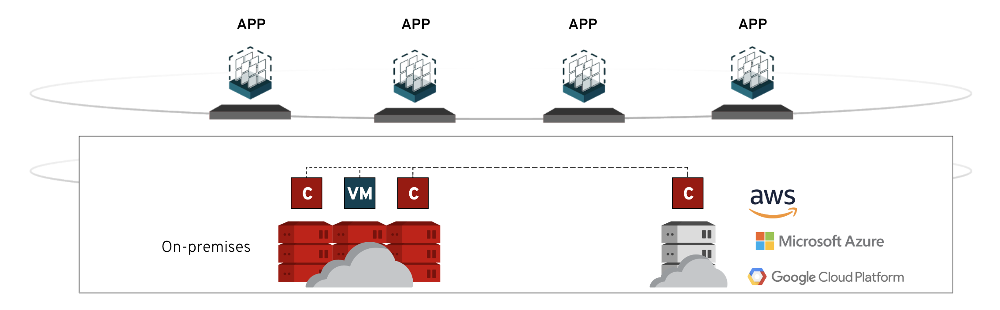
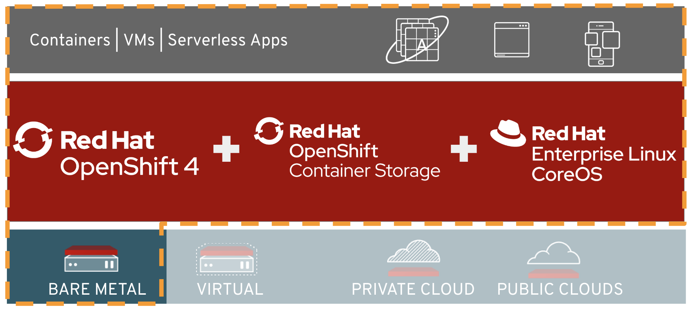
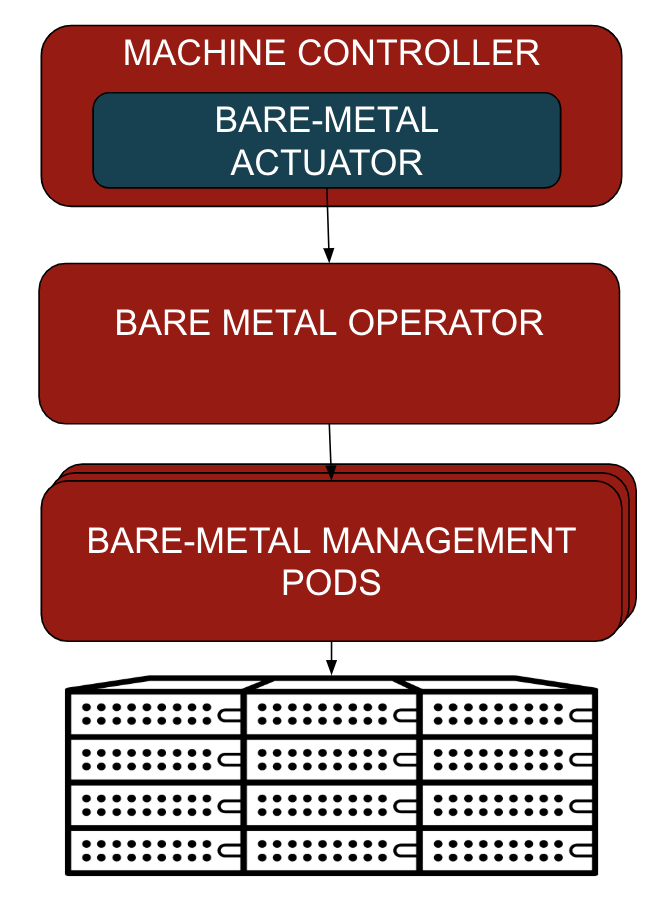
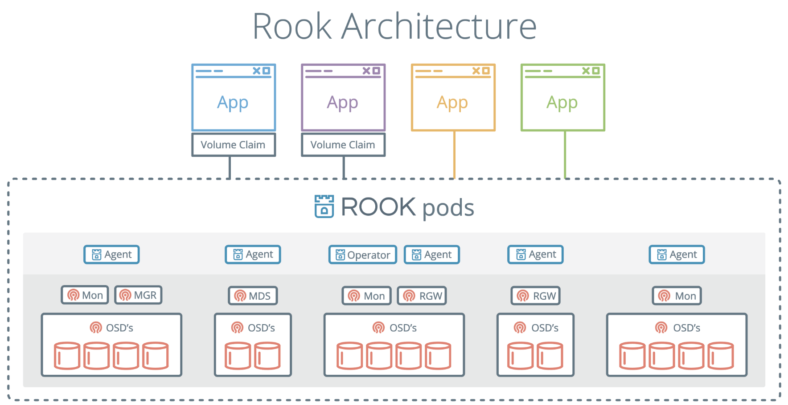

#**Introduction to OpenShift Baremetal IPI / Glossary**#

In this section we're going to give a bit more of a background as to the technology pieces that make up Barmetal IPI and why it's important that you understand how they fit together. This is not meant to be a comprehensive overview of each of the pieces, but should give you a solid working knowledge for this lab. In the interest of time, we suggest that you come back to this section when some of the long-running tasks are executing in later lab-steps, rather than reading through this content now, but it's your choice ;-)

## The Baremetal IPI Vision

Kubernetes Native Infrastructure, or KNI, is a project that was born out of an idea to provide a consistent and standardised user experience by utilising a common platform across multiple different types of cloud platform, in a multi hybrid-cloud scenario. In other words, a single platform for both on-premise and public-cloud consumption. For many years, Red Hat has provided solutions for on-premise infrastructure including Red Hat Virtualization, and Red Hat OpenStack Platform, which still very much have their place and strong roadmaps going forward, yet public cloud consumption has been continuing to become more and more prevalent in our customer base.

Over the past decade, Red Hat has advocated for Red Hat products to be available on the public cloud, yet with the on-set of containerised applications and Kubernetes as the foundational piece for orchestrating such workloads, we're having to think about how we're addressing the needs of our customers both on-premise and in the public cloud. Red Hat is firm on the notion that OpenShift will be our core hybrid-cloud abstraction layer for customers across the four footprints (baremetal, virtualisation, private cloud, and public cloud).

The vision of KNI is to address the gaps that exist in OpenShift that prevent it from being widely consumed on-premise, where today you need an underlying platform to manage hardware or deploy virtualised infrastructure as the base. That means addressing more enterprise type use-cases like baremetal management, high-availability, complicated networking strategies, and maintenance strategies. Many of our customers continue to rely on VMware to run OpenShift, or are embarking on a strategy to run OpenShift on OpenStack, both entirely credible deployment options but add additional layers, more complexity, and ultimately more things to maintain.

KNI is about extending the OpenShift vision of a single, consistent, standardised user experience for both the end user and the administrator into the datacentres and edge sites of our customers; build your application on the open-standards that are OpenShift/Kubernetes and run it anywhere. Furthermore, the vision of KNI is to also expand OpenShift's capabilities to self-manage virtualisation and hyper-converged storage, meaning that even legacy virtualised applications can be provisioned on such infrastructure via a consistent UI/CLI/API.

The same apps, either containerised or virtualised, running across multiple cloud providers and on-premise:

From a product perspective, this is ultimately what the stack for KNI looks like. We're leveraging Red Hat OpenShift Container Platform 4.x, alongside Red Hat OpenShift Container Storage (based on Ceph/Rook), all built on-top of Red Hat Enterprise Linux CoreOS as the base:

The first **target** go-to-market plan for KNI, or the first productised release, is planned to be in the form of **RHHI.next**, where we have a highly-prescribed stack of hardware with a set configuration that we plan on using to test the market for interest in both the software stack itself and an appliance-like model that aims to maximise the user-experience.

But we have to be absolutely clear here - this is a long-term strategy that we're embarking on, it's not a VMware replacement, it's not an OpenStack/RHV replacement, it will take a long time to get OpenShift to the same levels of capabilities that some of the other on-premise solutions can provide, let's run before we walk here and continue to sell what we have on the truck today - stable, mature, and capable pieces of software.

Below we'll explore some more of the components and puzzle pieces that make up the KNI initiative that may fill in the blanks for the rest of this lab.

## Metal³

The [Metal³](http://metal3.io/) (or Metal Kubed) project attempts to provide the components that are missing from Kubernetes that allow customers to deploy, manage, and scale clusters based on real baremetal systems with a high-level of integration; i.e. to give the same capabilities to baremetal that administrators have with Kubernetes clusters based on public cloud platforms.

One of the major components that the Metal³ project settled on was the introduction of OpenStack Ironic as a stable tool to manage the baremetal systems themselves, everything else in this project is then concerned with stitching the rest of it together, e.g. provding the resource definitions for `BareMetalHosts`, providing a specific operator (**baremetal-operator**) for dealing with these objects, and ensuring that the operator can take instruction from the wider Kubernetes cluster API operator via the **actuator**. The actuator conforms to the cluster-api provider interface that handles `Machine` objects by allocating `BareMetalHosts` from the inventory maintained through the Kubernetes API.

In addition to these, the Metal³ project manages some additional pieces of code, including some container images for certain services that it relies on, e.g. OpenStack Ironic, documentation, some development scripts, and a few other bits and pieces. The entire repo can be found [here](https://github.com/metal3-io). On-top of this we have an additional project called **openshift-metal3**; this is where OpenShift-specific code related to  Metal³ integration resides and is dependent on some of the metal3-io components.

From a Red Hat perspective, and therefore an OpenShift perspective, there are essentially two major baremetal host entrypoints that these projects are concerned with-

1. Integrating baremetal system management as part of the OpenShift installer, so that the cluster controlplane can be initially deployed with baremetal systems. This requires the OpenShift installer, with the new baremetal platform support, which enables deployment of the initial master nodes via OpenStack Ironic. At provisioning time, the OpenShift installer injects the known systems into a temporary Ironic server (that we'll explore later) and waits for them to be provisioned with Red Hat CoreOS before having OpenShift deployed once they come up.  
2. Integrating baremetal system management as part of post-deployment mechanisms for on-going maintenance, cluster scale operations, and so on. This essentially requires the cluster to be aware of the `BareMetalHost` resources as controlled by the **baremetal-operator**, and for them to be linked to `Machine` and `Node` resources for proper operation/integration.  In this model Ironic is hosted on the cluster and driven via the baremetal-operator to enable deployment of physical `BareMetalHost` resources.

From a basic perspective, the architecture looks like the following:

## dev-scripts

The dev-scripts are a set of scripts that allow the developers to spin up KNI-based environments quickly on virtual machines or baremetal for the purpose of writing code, testing features, or completing end to end demos. The dev-scripts are certainly not what customers would use, but as they're heavily maintained by the KNI engineering organisation they're a great way to get started. In this lab we'll be using the dev-scripts to deploy our environment, albeit slightly customised!

The repo for the dev-scripts lives in the **"openshift-metal3"** repo and can be found [here](https://github.com/openshift-metal3/dev-scripts), where some handy documentation can be found to get yourself started if you want to take your KNI journey further after this lab.

> **NOTE**: The dev-scripts repository is actually *contracting* over time as more and more of the glue code that exists in the dev-scripts repository that helps get KNI gets up actually gets merged into OpenShift itself. The OpenShift community have really embraced baremetal as a target platform and are helping us land code that will reduce all of the current workarounds that exist in the dev-scripts.

## OpenShift Installer

In Red Hat OpenShift Container Platform 4.x we introduced a brand new type of installer to the OpenShift world, based on the CoreOS acquisition. This new installer leverages Terraform to both deploy CoreOS (or now Red Hat Enterprise Linux CoreOS) and the Kubernetes (or Red Hat OpenShift Container Platform) on-top. The new installer is built with Golang and supports deployment on a number of platforms, but today the most comprehensive support is with Amazon Web Services.

More recently, the KNI team have been working to integrate all of the Metal³ requirements into the OpenShift installer in order to have a tightly integrated and optimal user experience for customers that want to deploy OpenShift on baremetal, without having to manually provision the infrastructure up-front. This has primarily meant ensuring that the installer has a Terraform provider for OpenStack Ironic and that it can deploy additional software to support baremetal clusters.

The installer baremetal docs can be found [here](https://github.com/openshift/installer/blob/master/docs/user/metal/install_ipi.md) if you'd like to read more information about how it works.

## OpenShift Release

When you hear the term OpenShift release, what we're really talking about is the "imagestream" that makes up a particular snapshot in time of the OpenShift distribution. The OpenShift team has done a fantastic job of implementing a continuous CI system that tests every patch, including upgrade testing between releases. All of the current releases, both nightly builds and CI-passing code can be found [here](https://openshift-release.svc.ci.openshift.org/).

Each OpenShift release contains, amongst many other things, a manifest of container images (and associated versions) that it will deploy, along with a built-in corresponding version of the OpenShift installer in binary format, as noted in the previous section above. When you deploy OpenShift you point to a given release, but usually this will be hidden from you - you'll simply pull the latest release and the installer will deploy OpenShift and pull the requested container images as per the manifest. In this lab we're going to be pulling a slightly customised OpenShift release so you'll get to see a bit of it.

## Provisioning/Bootstrap/Deployment

The way that we deploy OpenShift for KNI is very similar in process to how we would deploy OpenShift for other platforms like AWS, but there's a considerable amount more configuration going on to support baremetal deployments. When you deploy on AWS, the openshift-installer works interactively, asking you the bare-minimum number of questions in order to get you bootstrapped, typically your credentials, and away it goes - following the normal principal of "you get what you're given" and if you want to change things, do it post-deployment. This keeps things simple, consistent, and reliable from a deployment perspective.

As the openshift-installer is still building its support for baremetal configurations we have to implement a number of workarounds, customise a number of configuration files, and call the installer in a non-interactive fashion through an *install_config.yaml* file. Generally the provisioning flow looks like the following within a KNI environment, assuming that the hardware is all racked/stacked/cabled/etc:

1. A dedicated host is chosen to be the provisioning node; this machine is responsible for bootstrapping the cluster from baremetal, provisioning OpenShift via the openshift-installer from a specified OpenShift release, and runs Red Hat Enterprise Linux 7/8.  
2. Configuration is generated based on user preference, environmental specifics (such as a hardware inventory), specific KNI requirements, Kubernetes manifests and such.  
3. The configuration from (2) is passed to the openshift-installer which generates all of its required assets - ignition configs (customisations applied on-boot to CoreOS nodes, this can include scripts, files, etc), Terraform templates and associated variables so the required resources can be provisioned, e.g. the OpenShift nodes themselves, and a set of Kubernetes manifests that are to be applied to the cluster when it's up and running.   
4. The openshift-installer provisions a bootstrap VM (based on Red Hat CoreOS) on the provisioning host that's configured to run bootstrap/provisioning services, including OpenStack Ironic. This Ironic instance is ephemeral and will be used to deploy only the OpenShift masters on baremetal with Red Hat CoreOS.  The bootstrap VM is responsible for generating and exposing ignition configurations for master nodes (via http).  
5. Once Ironic provisioning has been successful, the supplied ignition configuration starts cluster services on the master nodes, including an etcd cluster for persistent OpenShift/Kubernetes data
6. After the initial control-plane cluster is formed, the cluster bootstrap process is performed, as specified by any installer manifests.
7. After the bootstrap-complete event occurs, the bootstrap VM is destroyed and the masters can proceed with the rest of the OpenShift cluster bootstrap independently. The masters work towards deploying all of the requested Kubernetes manifests and associated configurations, role-based access control policies, machine config, supporting infrastructure pods, and networking configurations.  
8. The openshift-installer will continually poll both the bootstrap VM (during its operations) and then the resulting OpenShift cluster for success before shutting down upon a successful deployment, or erroring at any failure.  
9. The openshift-installer seeds the list of baremetal servers that make up the underlying infrastructure to the baremetal-operator so they can immediately be managed as cluster resources (Note: this step is still under development).  
10. The deployment succeeds and authentication information is written to a local configuration file.

## OpenShift Container Storage (OCS/Rook)

OpenShift 4.x, going forward, is standardising on Ceph as the consistent backend storage platform, replacing some of the earlier generations of storage platforms based on Gluster. We're introducing OpenShift Container Storage based on the [Rook](https://rook.io) operator - Rook turns distributed storage systems into self-managing, self-scaling, self-healing storage services. It automates the tasks of a storage administrator: deployment, bootstrapping, configuration, provisioning, scaling, upgrading, migration, disaster recovery, monitoring, and resource management. Rook uses the power of the Kubernetes platform to deliver its services: cloud-native container management, scheduling, and orchestration.

The Rook project supports multiple different backends, but we're primarily interested in leveraging its capabilities to deploy/maintain Red Hat Ceph Storage. Here's what it looks like from a high-level view:

