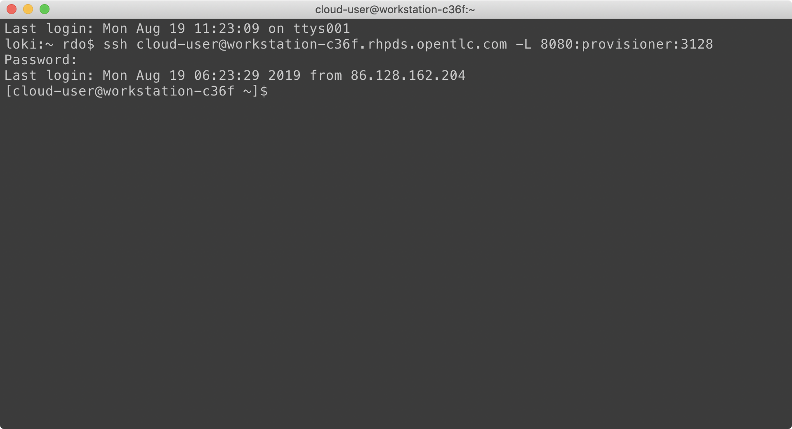

# Lab Instructions

These lab instructions are very self explanatory, in that we try our best to explain everything that's going on; give you the neccessary background into the tasks so you understand the concepts and why you're doing it, followed by screenshots and links where required, and crucially the commands you need to execute with expected outputs.

When we're asking you to execute terminal **commands** you'll see it in the following format:

~~~bash
user@the-system$ the-command
(the output)
~~~

For example:

~~~bash
rdo@laptop$ uptime
11:27  up 84 days, 16:48, 3 users, load averages: 1.21 1.40 1.52
~~~

This ensures that you're executing the correct commands on the correct system, with the correct user. The instructions are provided in an easy to copy & paste mechanism, although please don't use this lab as a copy & paste exercise; it's easy to make mistakes even when copying and it's not conducive to learning things properly :-).

> **NOTE**: If you see "**(...)**" in the command output, we've put this to advise that there's considerable output from the command being executed and it has been omitted to keep this lab guide clean.

# Lab Environment

Each attendee of this lab, regardless of whether you're following this after the Red Hat Tech Exchange has finished, will be utilising a public-cloud based dedicated environment, i.e. a fully virtualised environment that's just for you; you won't need to share and it doesn't matter if you break it - we can easily spin up some more environments, although you may run out of time during the allocated timeslots if you ask to use a different environment after you've started.

For the Red Hat Tech Exchange events we're utilising OpenTLC to provide the resources required for this lab, and whilst it may not be the most performant solution it's great for giving us on-demand, scalable, and flexible lab sessions. It's important to note that all of RHPDS is virtualised, therefore all of the "baremetal" nodes you'll leverage are actually virtual machines, and we have to mimic IPMI (baremetal control) capabilities through the OpenTLC API, although all of this will have been pre-configured for you, so the process you follow in this lab will be no different to what you'd do with real baremetal. Ultimately, the aim of this lab is to make it "as close as feasibly possible" to a real-world scenario, albeit within the constraints of the Ravello platform.

Each dedicated environment has a '**provision**' host that acts as a gateway in, and is uniquely identified through DNS. Once you've connected to your provision virtual machine below, you'll be provided with instructions on how to complete the lab. Everyone's instructions are identical after connection to the provision host, as everyones environment has been provisioned from the same template.

The '**provision**' host has been prebuilt and will be used to bootstrap all of the OpenShift cluster on-top of the underlying "baremetal" infrastructure that will be automated through OpenStack Ironic and IPMI. This provisioner host has been partially configured for speed and convenience, but not in any way that will detract from the labs purpose, or cause confusion, this machine will be used extensively throughout the lab as our main point of execution.

There are many other dedicated machines (VM's in OpenTLC) that will make up the rest of the lab, some of the internals can be seen below, and will be accessible to you in your lab; and can be useful for viewing the console output of some of your systems, just be very careful with it when you're using it (a link will be displayed for you when you follow the instructions in the next section). For information purposes, here's mine:

See below for a description of each of the hosts you can see:

| Node Name | Description |
|---|---|
| **provision** | The partially build-up provisioner host, a RHEL8 machine pre-configured with package access that will bootstrap the rest of the cluster as per the instructions in later lab sections.  This host is also our jumphost that we will connect directly to. |
| **master-0** | An empty, i.e. no operating system installed or configured, sytem that will become one of our OpenShift master systems. Note that this system has been configured on the RHPDS side to be connected to the correct networks.|
| **master-1** | As above, an additional master. |
| **master-2** | As above, an additional master. |
| **worker-0** | A further empty system that we'll use during the deployment of OpenShift cluster.  Further we will add additional storage for OCS during lab.|
| **worker-1** | As above, an additional worker. |
| **worker-2** | As above, an additiona worker that will be added after OpenShift cluster deployment |
| **bmc** | This host provides vBMC (i.e. virtual IPMI) capabilities and wraps IPMI commands back to the Ravello API with an authentication token. This setup is automated and you don't have to worry about configuring it in this lab; assume that IPMI is automagically available in your lab already.   This machine also hosts DHCP and DNS for our environment, as will be required for all KNI deployments in the field, and also acts as a package repo server. |

# Connecting

You'll need to use your own laptop to connect into your (public cloud hosted) dedicated environment - hopefully the WiFi will sustain so many connections :-). It's on this environment that you'll perform the later lab instructions, and you should only need to use your terminal emulator and a web-browser to complete all of the tasks.

To get started, we need to request your own dedicated session, for this we use a tool from GPTE called GuidGrabber... in your web browser open [this link](https://www.opentlc.com/gg/gg.cgi?profile=generic_rhte) (https://www.opentlc.com/gg/gg.cgi?profile=generic_rhte). What you should see is as follows, noting that if there's more than one lab shown in the drop-down box ensure you select **'R2024 - Hands on with KNI/RHHI.next'** and have entered the activation key '**kni**', along with your own email address:

This will allocate a pre-deployed session for your usage with a **GUID** that's used to uniquely identify your session. Here's an example below:

You'll see that my assigned lab GUID is '**8a2e**' and is used to uniquely identify my session, and makes up part of the address you'll need to connect to in the next steps. ***DO NOT SHARE THIS, IT'S UNIQUE TO YOU.***

> **NOTE**: In the screenshot above, the lab instructions location is incorrect, or at least it's private during the event, but your screen should show the correct location, if it doesn't, the lab instructions are available [here](https://people.redhat.com/roxenham/rhte-rhhi).

The environment takes around 20 minutes to power-up, and this should have already been done for you prior to the session starting, but don't be alarmed if you cannot connect in straight away, it may just require a few more minutes. Once it's up and running, we can connect to our jumphost:

~~~bash
you@laptop$ ssh cloud-user@workstation-8a2e.rhpds.opentlc.com -L 8080:provisioner:3128
(...)
~~~

> **NOTE**: The password above is simply '**r3dh4t1!**' as displayed in the previous GuidGrabber page. Also note that we're using port forwarding within this environment so we can access the web console in a later lab session, but forget about this for now.

Now we're ready to proceed with the rest of our lab steps. If you had any problems getting access or if you have any questions, please feel free to ask any of the moderators at any time. If you lose your connection details you can return [here](https://www.opentlc.com/gg/gg.cgi?profile=generic_rhte) at any time.

> **NOTE**: If you've **not** already been provided with connection details or you do not have access to the mechanism we use to procure an environment (**guidgrabber**) please ask and we'll ensure that access is provided.

