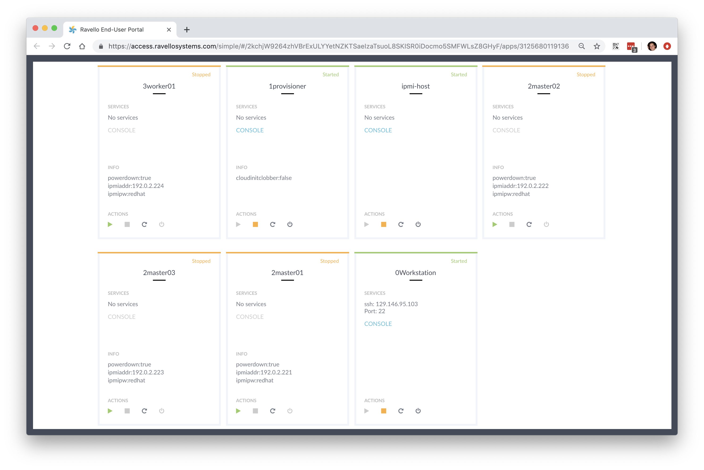
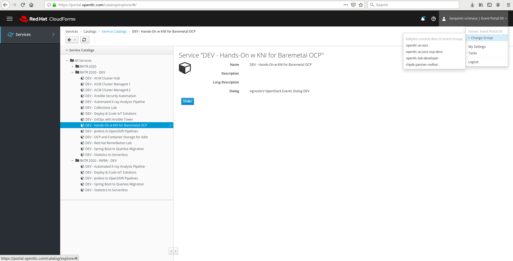
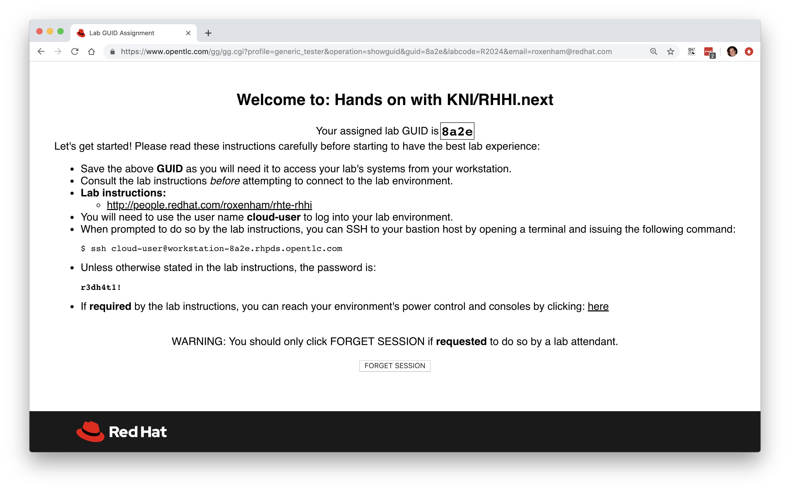

# Getting Started

These lab instructions are self-explanatory giving you the necessary background into the tasks needed to understand the concepts and why you're doing it. We tried to include relevant screenshots and links where required, and provide examples of the necessary commands you need to execute in a clear and easy to follow format.

When we're asking you to execute terminal **commands** you'll see it in the following format:

~~~bash
user@the-system$ the-command
(the output)
~~~

For example:

~~~bash
user@the-system$ uptime
11:27  up 14 days, 16:48, 3 users, load averages: 1.21 1.40 1.52
~~~

This ensures that you're executing the correct commands on the correct system, with the correct user. The instructions are provided in an easy to copy and paste mechanism, although please don't use this lab as a copy and paste exercise; it's easy to make mistakes even when copying and it's not conducive to learning things properly :-).

> **NOTE**: If you see "**(...)**" in the command output, we've put this to advise that there's considerable output from the command being executed and it has been omitted.

# Lab Environment

Each attendee of this lab will be utilising their own dedicated environment, i.e. a fully virtualised environment that's just for your exclusive use.

For the Red Hat Tech Ready events we're utilising GPTE's OpenTLC platform to provide the resources required for this lab, and whilst it's not a real baremetal cluster it's great for giving us on-demand, scalable, and flexible lab sessions. It's important to note that all of OpenTLC is virtualised, therefore all of the "baremetal" nodes you'll leverage are actually virtual machines running on top of OpenStack. We have been able to mimic IPMI (baremetal control) capabilities through the OpenStack API, and this backend IPMI automation has been pre-configured for you, so the process you follow in this lab is no different to what you'd do with real baremetal. Ultimately, the aim of this lab is to make it "as close as feasibly possible" to a real-world scenario, albeit within the constraints of the OpenTLC platform.

Each dedicated environment has a '**provision**' host that acts as a gateway in, and is uniquely identified through DNS. Once you've connected to your provision machine (details below), you'll be able to begin following the instructionsfor the lab. Everyone's instructions are identical after connection to the provision host, as everyones environment has been provisioned from the same template.

> **NOTE**: If you'd like to see how we've done it, have a look at the [AgnosticD automation templates](https://github.com/RHFieldProductManagement/agnosticd/tree/development/ansible/configs/kni-osp).

The '**provision**' host has been prebuilt and is also used to bootstrap all of the OpenShift cluster on top of the underlying "baremetal" infrastructure that will be automated through OpenStack Ironic and IPMI. To be very clear here, the OpenShift cluster that we deploy will use OpenStack Ironic (running within OpenShift) to speak to a fake IPMI translator that controls the power management state of OpenStack-based virtual machines underneath that are pretending to be our "baremetal nodes". This provisioner host has been partially configured for speed and convenience, but not in any way that will detract from the lab's purpose, or cause confusion - this machine will be used extensively throughout the lab as our main point of execution.

There are many other dedicated machines (VM's in the underlying OpenStack platform) that will make up the rest of the lab, some of the internals can be seen below in a screenshot; however, you won't have access to this OpenStack layer. For informational purposes, here's a screenshot from the OpenStack side:

See below for a description of each of the hosts you can see:

| Node Name | Description |
|---|---|
| **provision** | The provisioner host is a RHEL8 machine pre-configured with package access that will bootstrap the rest of the cluster as per the instructions in later lab sections.  This host is also our jumphost that we will connect directly to. |
| **master-0** | An empty, i.e. no operating system installed or configured, sytem that will become one of our OpenShift master systems. Note that this system has been pre-configured to be connected to the correct networks.|
| **master-1** | As above, an additional master. |
| **master-2** | As above, an additional master. |
| **worker-0** | A further empty system that we'll use during the deployment of the OpenShift cluster.  During the lab you will add additional storage to these for OCS.|
| **worker-1** | As above, an additional worker. |
| **worker-2** | As above, an additiona worker that will be added after OpenShift cluster deployment |
| **bmc** | This host provides vBMC (i.e. virtual IPMI) capabilities and wraps IPMI commands back to the OpenStack API with an authentication token. This setup is automated and you don't have to worry about configuring it in this lab; assume that IPMI is automagically available in your lab already.   This machine also hosts DHCP and DNS for our environment, as will be required for all KNI deployments in the field, and also acts as a package repo server. |

# Connecting

You'll need to use your own laptop/workstation to connect into the dedicated environment that has been provided to you. It's on this environment that you'll perform the later lab instructions, and you should only need to use your terminal emulator and a web-browser to complete all of the tasks.

**To get started, you'll need to request your own dedicated lab environment.**

From the Content Hub for RHTR 2020 you will be directed to the Lab Portal (https://portal.opentlc.com/catalog/explorer#/). What you should first see is a list of your current services, which will likely be empty unless you've attended any other labs, you'll need to navigate to "**Services**" --> "**Catalogs**" --> "**All Services**" --> "**RHTR 2020**" --> "**Hands-On w KNI for Baremetal OCP**". See the screenshot example below:

When you're ready, click "**Order**", then on the resulting page confirm that you have the time to complete the lab, and select "**Submit**". This will allocate a pre-deployed session for your usage with a **GUID** that's used to uniquely identify your session. You will get an email on how to access the environment once it has been provisioned.  Here's an example below:

The environment takes around 20 minutes to power-up, but don't be alarmed if you cannot connect in straight away, it may just require a few more minutes. Once it's up and running, we can connect to our provision node with the details found in the email.

Simply ssh as the `lab-user` to the value given for the "**Bastion host**" at the bottom of your email. You'll find the host's password in that email as well.

Here's an example:

~~~bash
[bschmaus@bschmaus ~]$ ssh lab-user@provision.hhnfk.dynamic.opentlc.com
(...)
lab-user@provision.hhnfk.dynamic.opentlc.com's password: (Redhat01)

Activate the web console with: systemctl enable --now cockpit.socket

This system is not registered to Red Hat Insights. See https://cloud.redhat.com/
To register this system, run: insights-client --register

[lab-user@provision ~]$ ls
pull-secret.json  scripts
[lab-user@provision ~]$ 
~~~

If you had any problems getting access or if you have any questions, please feel free to ask any of the moderators at any time.

## tmux

We also recommend that you download and install tmux (a terminal multiplexer) in case you lose connectivity to the provisining host. Some of the commands in the lab are long running  so running the lab in a tmux session will prevent your progress from being compromised by network dropouts. 

Install tmux on the provisoning host, and then run it before continuing. You'll know you're in tmux because of the green band at the bottom of the display:

~~~bash
[lab-user@provision ~]$ sudo dnf install tmux -y
(...)

[lab-user@provision ~]$ tmux
[lab-user@provision ~]$ 
~~~

> **NOTE**: For help with tmux, including  search [google](https://www.google.com/search?q=tmux+help&oq=tmux+help) or try [here](https://tmuxguide.readthedocs.io/en/latest/tmux/tmux.html).

## Onto the lab

[Continue on to the labs...](https://github.com/RHFieldProductManagement/baremetal-ipi-lab/blob/master/03-configure-local-registry-cache.md)