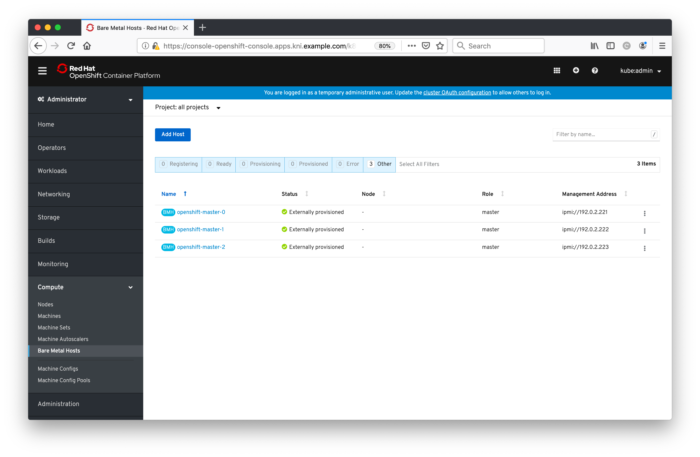

#**Baremetal Operator**

Now that our cluster is up and running, we can start playing around with it and figure out how all of the baremetal management is configured through the baremetal-operator. The baremetal-operator pods live in the 'openshift-machine-api' namespace:

~~~bash
[cloud-user@provision ~]$ oc get pods -n openshift-machine-api
NAME                                           READY   STATUS    RESTARTS   AGE
cluster-autoscaler-operator-688d896864-ttn5m   2/2     Running   0          103m
machine-api-controllers-55fc6f744-48zw2        4/4     Running   0          111m
machine-api-operator-659cd8dc7b-qvqzp          2/2     Running   0          113m
metal3-85898fbcd6-bjl69                        8/8     Running   0          108m
~~~

Here, the metal3 pod is the pod we're interested in - it's where we house all of the relevant containers, including the baremetal-operator itself:

~~~bash
[cloud-user@provision ~]$ oc describe pod metal3-85898fbcd6-bjl69 -n openshift-machine-api
(...)
~~~

As part of the initial bootstrap of the cluster, the OpenShift installer handed control over the underlying baremetal machines to the baremetal-operator running on the cluster and automatically seeded the `BareMetalHost` resources:

~~~bash
[cloud-user@provision ~]$ oc get baremetalhosts -n openshift-machine-api
NAME       STATUS   PROVISIONING STATUS      CONSUMER                     BMC                     HARDWARE PROFILE   ONLINE   ERROR
master-0   OK       externally provisioned   schmaustech-master-0         ipmi://10.20.0.3:6202                      true     
master-1   OK       externally provisioned   schmaustech-master-1         ipmi://10.20.0.3:6201                      true     
master-2   OK       externally provisioned   schmaustech-master-2         ipmi://10.20.0.3:6205                      true     
worker-0   OK       provisioned              schmaustech-worker-0-2czx7   ipmi://10.20.0.3:6204   openstack          true     
worker-1   OK       provisioned              schmaustech-worker-0-qgmhk   ipmi://10.20.0.3:6200   openstack          true    
~~~

You'll also see that in OpenStack Ironic the nodes are stuck in an '**active**' state, not allowing them to progress:

~~~bash
[cloud-user@provision ~]$ export OS_TOKEN=fake-token
[cloud-user@provision ~]$ export OS_URL=http://172.22.0.3:6385
[cloud-user@provision ~]$ openstack baremetal node list
+--------------------------------------+----------+--------------------------------------+-------------+--------------------+-------------+
| UUID                                 | Name     | Instance UUID                        | Power State | Provisioning State | Maintenance |
+--------------------------------------+----------+--------------------------------------+-------------+--------------------+-------------+
| 2d68e1cd-8d85-4dcc-a289-53c2770f3abb | master-1 | f2398c03-60f4-44be-84cb-d03d22509345 | power on    | active             | False       |
| 41ce9485-ae8b-42cc-ad85-4771e41e0af1 | master-0 | a30ce010-4c29-4fe7-9eb1-2b4f70f9b618 | power on    | active             | False       |
| ca9ca2b2-8de9-4521-8b94-514222400631 | master-2 | f16b8768-6f3f-44b1-8135-7b159984e44d | power on    | active             | False       |
| cffbddd5-2a1c-430f-8ffe-a5409a0f3538 | worker-0 | 099f8902-117e-4d58-8e67-7b8e700582e6 | power on    | active             | False       |
| 7eaa2bdb-0102-419c-9f5b-0f7e35693d6b | worker-1 | 656cb417-61b0-4a02-b4f5-393726536002 | power on    | active             | False       |
+--------------------------------------+----------+--------------------------------------+-------------+--------------------+-------------+

~~~

> **NOTE**: You'll also notice that the IP address for Ironic has changed, it's now *172.22.0.3*, whereas when we were deploying it was *172.22.0.2*, only because it's now running on the cluster, no longer on the (long-since-deleted) bootstrap VM.

Great! All looks good with the baremetal nodes! However, there's one more step for us to do...

Now that we have our baremetal hosts registered with the baremetal operator, we need to tell OpenShift which `Node` is which. Every computer within a Kubernetes environment is considered a `Node`, but with OpenShift 4.0+ the cluster is more aware of the underlying infrastructure, so it can make adjustments such as scaling the cluster, adding new nodes, and deleting them. OpenShift utilises the concept of `Machines` and `MachineSets` to help it understand the different types of underlying infrastructure, including public cloud platforms like AWS. A `Machine` is a fundamental unit that describes the host for a `Node`.

When we registered our baremetal hosts we created corresponding `Machine` objects (see **CONSUMER**) that are linked to our `BareMetalHost` objects:

~~~bash
[cloud-user@provision ~]$ oc get baremetalhosts -n openshift-machine-api -o=custom-columns=NAME:.metadata.name,CONSUMER:.spec.consumerRef.name
NAME       CONSUMER
master-0   schmaustech-master-0
master-1   schmaustech-master-1
master-2   schmaustech-master-2
worker-0   schmaustech-worker-0-vlvbf
worker-1   schmaustech-worker-0-rhsz4
~~~ 

However, all of the `Nodes`, i.e. the OpenShift/Kubernetes nodes that are our masters, are not currently linked to their corresponding `Machine`. You can verify this in the UI too - if you open up your OpenShift console again and scroll down to '**Compute**' on the left hand side and select '**Nodes**', you'll notice that each of the nodes doesn't have a corresponding `Machine` reference:

Furthermore, each `BareMetalHost` doesn't have a `Node` assigned, verified by selecting the '**Machines**' option in the same left hand side menu, note that you will need to select **all-projects** from the 'project' drop down at the top to see these entries:

> **NOTE**: There's a lot of output from the above command, but it's simply running a `patch` on each `Machine` object to link them together.

Now, if you ask OpenShift for the details of one of the `Machines` you can see how it's all connected together, noting the bits we've added for clarity:

~~~bash
kni@provisioner$$ oc get machine/kni-master-0 -n openshift-machine-api -o yaml
apiVersion: machine.openshift.io/v1beta1
kind: Machine
metadata:
  annotations:
    metal3.io/BareMetalHost: openshift-machine-api/openshift-master-0
  creationTimestamp: "2019-08-21T18:23:44Z"          ^^ this is the **BareMetalHost**
  finalizers:
  - machine.machine.openshift.io
  generation: 1
  labels:
    machine.openshift.io/cluster-api-cluster: kni
    machine.openshift.io/cluster-api-machine-role: master
    machine.openshift.io/cluster-api-machine-type: master
  name: kni-master-0                                     <--- this is the **machine**
  namespace: openshift-machine-api
  resourceVersion: "35928"
  selfLink: /apis/machine.openshift.io/v1beta1/namespaces/openshift-machine-api/machines/kni-master-0
  uid: cf7ded7d-c440-11e9-8e1b-525400427ae5
spec:
  metadata:
    creationTimestamp: null
  providerSpec:
    value:
      hostSelector: {}
      image:
        checksum: http://172.22.0.3:6180/images/rhcos-42.80.20190725.1-openstack.qcow2/rhcos-42.80.20190725.1-compressed.qcow2.md5sum
        url: http://172.22.0.3:6180/images/rhcos-42.80.20190725.1-openstack.qcow2/rhcos-42.80.20190725.1-compressed.qcow2
      metadata:
        creationTimestamp: null
      userData:
        name: master-user-data
status:
  addresses:
  - address: 192.168.111.2
    type: InternalIP
  - address: master-0
    type: Hostname
  - address: master-0
    type: InternalDNS
  lastUpdated: "2019-08-21T20:11:11Z"
  nodeRef:
    kind: Node
    name: master-0                                      <--- this is the **node**
    uid: 92761430-c440-11e9-8e1b-525400427ae5
~~~

You can also see this represented in the OpenShift console if you want to take a look. Open up your web browser again and navigate to '**Compute**' --> '**Machines**' (see the '**Node**' references), you'll need to make sure that you either select '**all-projects**' or '**openshift-machine-api**' in the Project drop down:

And then '**Compute**' --> '**Bare Metal Hosts**':

