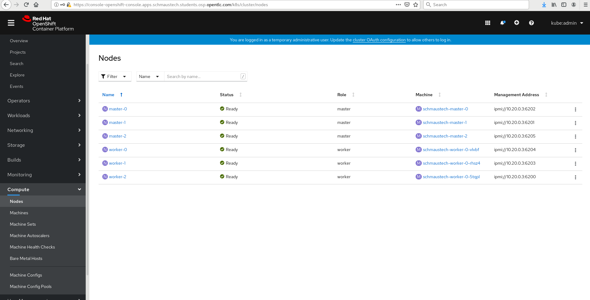
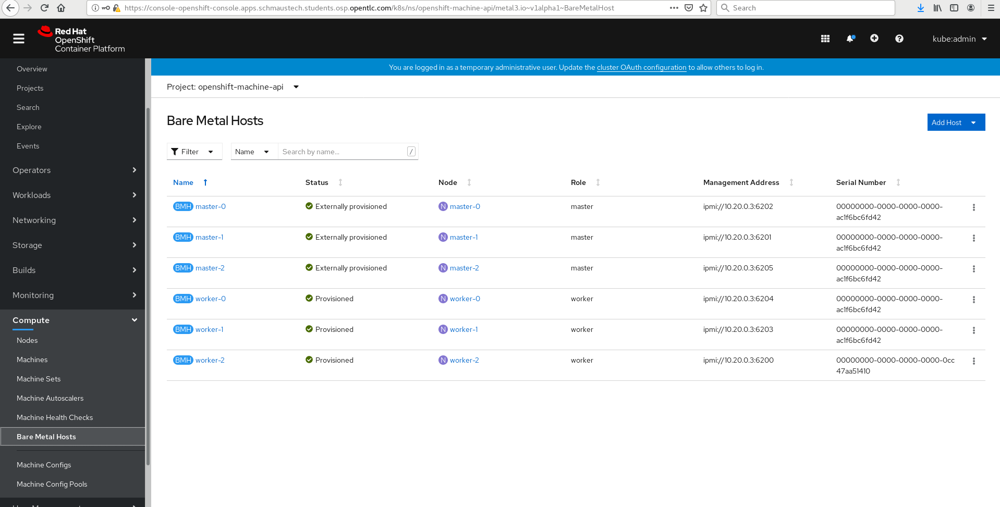

# Baremetal Operator

Now that our cluster is up and running, we can start playing around with it and figure out how all of the baremetal management is configured through the baremetal-operator. The baremetal-operator pods live in the 'openshift-machine-api' namespace:

~~~bash
[lab-user@provision ~]$ oc get pods -n openshift-machine-api
NAME                                           READY   STATUS    RESTARTS   AGE
cluster-autoscaler-operator-568855ff87-vwc4r   2/2     Running   1          42h
machine-api-controllers-74bc4b5dd7-pnxll       4/4     Running   0          42h
machine-api-operator-7744b46cbc-xchnc          2/2     Running   1          42h
metal3-7c494cd968-xlgmk                        8/8     Running   20         42h
~~~

Here, the metal3 pod is the pod we're interested in - it's where we house all of the relevant containers, including the baremetal-operator itself:

~~~bash
[lab-user@provision ~]$ oc describe pod metal3-85898fbcd6-bjl69 -n openshift-machine-api
(...)
~~~

As part of the initial bootstrap of the cluster, the OpenShift installer handed control over the underlying baremetal machines to the baremetal-operator running on the cluster and automatically seeded the `BareMetalHost` resources:

~~~bash
[lab-user@provision ~]$ oc get baremetalhosts -n openshift-machine-api
NAME       STATUS   PROVISIONING STATUS      CONSUMER                     BMC                     HARDWARE PROFILE   ONLINE   ERROR
master-0   OK       externally provisioned   schmaustech-master-0         ipmi://10.20.0.3:6202                      true     
master-1   OK       externally provisioned   schmaustech-master-1         ipmi://10.20.0.3:6201                      true     
master-2   OK       externally provisioned   schmaustech-master-2         ipmi://10.20.0.3:6205                      true     
worker-0   OK       provisioned              schmaustech-worker-0-vlvbf   ipmi://10.20.0.3:6204   openstack          true     
worker-1   OK       provisioned              schmaustech-worker-0-rhsz4   ipmi://10.20.0.3:6203   openstack          true     
~~~

You'll also see that in OpenStack Ironic the nodes are in an '**active**' state, not allowing them to progress:

~~~bash
[lab-user@provision ~]$ export OS_TOKEN=fake-token
[lab-user@provision ~]$ export OS_URL=http://172.22.0.3:6385
[lab-user@provision ~]$ openstack baremetal node list
+--------------------------------------+----------+--------------------------------------+-------------+--------------------+-------------+
| UUID                                 | Name     | Instance UUID                        | Power State | Provisioning State | Maintenance |
+--------------------------------------+----------+--------------------------------------+-------------+--------------------+-------------+
| 01971e83-2def-4b25-ac26-7b084eee284d | master-0 | 4dc76022-da6d-442d-9585-c19bab11dcc2 | power on    | active             | False       |
| 57c61d9c-fe62-4616-8107-e0e366f296cf | worker-0 | 959c785b-355f-4d18-be8c-c0c26cd56c38 | power on    | active             | False       |
| 25e1a6db-781d-430a-b388-8d4fe15ef00c | master-1 | bf0df03b-2d97-4e21-a916-a7455fcf9ce1 | power on    | active             | False       |
| b66c42a5-b2ec-4adc-a088-d68bee37b45f | master-2 | 622fac99-c471-4405-ad9d-137ebc5afa09 | power on    | active             | False       |
| 1e2f164c-57bb-4223-b5e3-b255755ac833 | worker-1 | 3103eefe-04ab-4b77-bf37-5f16c3380f8b | power on    | active             | False       |
+--------------------------------------+----------+--------------------------------------+-------------+--------------------+-------------+
~~~

> **NOTE**: You'll also notice that the IP address for Ironic has changed, it's now *172.22.0.3*, whereas when we were deploying it was *172.22.0.2*, only because it's now running on the cluster, no longer on the (long-since-deleted) bootstrap VM.

Great! All looks good with the baremetal nodes!

Now that we have our baremetal hosts registered with the baremetal operator, we can explore how OpenShift knows which `Node` is which. Every computer within a Kubernetes environment is considered a `Node`, but with OpenShift 4.x the cluster is more aware of the underlying infrastructure, so it can make adjustments such as scaling the cluster, adding new nodes, and deleting them. OpenShift utilises the concept of `Machines` and `MachineSets` to help it understand the different types of underlying infrastructure, including public cloud platforms like AWS. A `Machine` is a fundamental unit that describes the host for a `Node`.

When we registered our baremetal hosts we created corresponding `Machine` objects (see the **CONSUMER** label in the output) that are linked to our `BareMetalHost` objects:

~~~bash
[lab-user@provision ~]$ oc get baremetalhosts -n openshift-machine-api \
	-o=custom-columns=NAME:.metadata.name,CONSUMER:.spec.consumerRef.name
NAME       CONSUMER
master-0   schmaustech-master-0
master-1   schmaustech-master-1
master-2   schmaustech-master-2
worker-0   schmaustech-worker-0-vlvbf
worker-1   schmaustech-worker-0-rhsz4
~~~ 

However, all of the `Nodes`, i.e. the OpenShift/Kubernetes nodes that are our masters, are currently linked to their corresponding `Machine`. You can verify this in the UI too - if you open up your OpenShift console using the URL, username, and password details you saved in the last lab, and scroll down to '**Compute**' on the left hand side and select '**Nodes**', you'll notice that each of the nodes have a corresponding `Machine` reference:

Now, if you ask OpenShift for the details of one of the `Machines` you can see how it's all connected together, noting the bits we've added for clarity (look for the "**<==**" notation):

~~~bash
[lab-user@provision ~]$ oc get machine/$GUID-master-0 -n openshift-machine-api -o yaml
apiVersion: machine.openshift.io/v1beta1
kind: Machine
metadata:
  annotations:
    metal3.io/BareMetalHost: openshift-machine-api/master-0   <== This is the **Baremetalhost**
  creationTimestamp: "2020-09-23T19:50:57Z"
  finalizers:
  - machine.machine.openshift.io
  generation: 1
  labels:
    machine.openshift.io/cluster-api-cluster: schmaustech
    machine.openshift.io/cluster-api-machine-role: master
    machine.openshift.io/cluster-api-machine-type: master
  managedFields:
  - apiVersion: machine.openshift.io/v1beta1
    fieldsType: FieldsV1
    fieldsV1:
      f:metadata:
        f:labels:
          .: {}
          f:machine.openshift.io/cluster-api-cluster: {}
          f:machine.openshift.io/cluster-api-machine-role: {}
          f:machine.openshift.io/cluster-api-machine-type: {}
      f:spec:
        .: {}
        f:metadata: {}
        f:providerSpec:
          .: {}
          f:value:
            .: {}
            f:hostSelector: {}
            f:image: {}
            f:metadata: {}
            f:userData: {}
      f:status: {}
    manager: cluster-bootstrap
    operation: Update
    time: "2020-09-23T19:50:57Z"
  - apiVersion: machine.openshift.io/v1beta1
    fieldsType: FieldsV1
    fieldsV1:
      f:metadata:
        f:annotations:
          .: {}
          f:metal3.io/BareMetalHost: {}
        f:finalizers:
          .: {}
          v:"machine.machine.openshift.io": {}
      f:status:
        f:addresses: {}
        f:phase: {}
    manager: machine-controller-manager
    operation: Update
    time: "2020-09-23T20:23:25Z"
  - apiVersion: machine.openshift.io/v1beta1
    fieldsType: FieldsV1
    fieldsV1:
      f:status:
        f:lastUpdated: {}
        f:nodeRef:
          .: {}
          f:kind: {}
          f:name: {}
          f:uid: {}
    manager: nodelink-controller
    operation: Update
    time: "2020-09-23T20:23:25Z"
  name: schmaustech-master-0                <== This is the **Machine**
  namespace: openshift-machine-api
  resourceVersion: "19901"
  selfLink: /apis/machine.openshift.io/v1beta1/namespaces/openshift-machine-api/machines/schmaustech-master-0
  uid: 4d5550fe-38a2-42f9-bdb2-37795d3c408a
spec:
  metadata: {}
  providerSpec:
    value:
      hostSelector: {}
      image:
        checksum: http://172.22.0.3:6180/images/rhcos-45.82.202008010929-0-openstack.x86_64.qcow2/rhcos-45.82.202008010929-0-compressed.x86_64.qcow2.md5sum
        url: http://172.22.0.3:6180/images/rhcos-45.82.202008010929-0-openstack.x86_64.qcow2/rhcos-45.82.202008010929-0-compressed.x86_64.qcow2
      metadata:
        creationTimestamp: null
      userData:
        name: master-user-data
status:
  addresses:
  - address: 172.22.0.30
    type: InternalIP
  - address: 10.20.0.100
    type: InternalIP
  - address: master-0
    type: Hostname
  - address: master-0
    type: InternalDNS
  lastUpdated: "2020-09-23T20:23:25Z"
  nodeRef:
    kind: Node                            <== This is **Node**
    name: master-0
    uid: 029f2a0d-ab31-41ec-8b63-bae477027662
  phase: Running

~~~

You can also see this represented in the OpenShift console. Open up your web browser again and navigate to '**Compute**' --> '**Machines**' (see the '**Node**' references), you'll need to make sure that you either select '**all-projects**' or '**openshift-machine-api**' in the Project drop down:

Also take a look at '**Compute**' --> '**Bare Metal Hosts**':

Notice the range of details available including IPMI details!

Let's move on and invesitgate [adding an additional worker in the next lab](https://github.com/RHFieldProductManagement/baremetal-ipi-lab/blob/master/06-addworker.md)!

