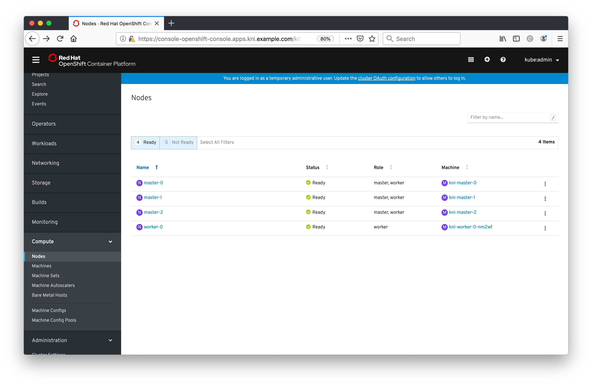
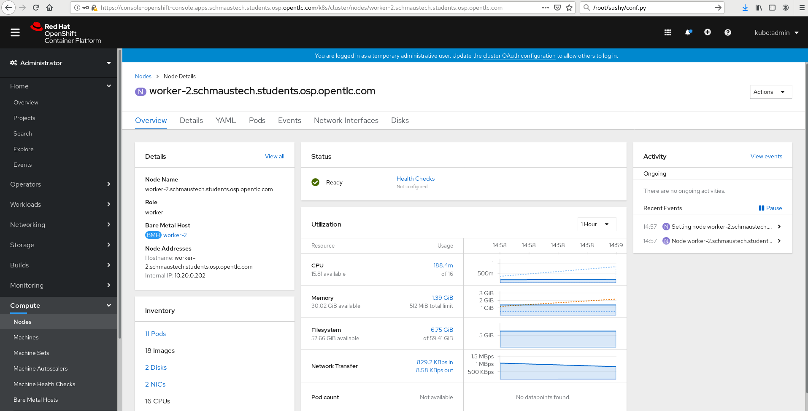

#**Adding/Building a Worker**

In this section we're going to demonstrate how to expand a KNI environment with an additional **worker** node, i.e. a node that will just run workloads, not cluster services. The eagle eyed amongst you may notice that we listed _"NUM\_WORKERS=0"_ in our initial configuration file, but we've actually got a spare unused "baremetal" host in the environment you're working in. We simply need to tell the baremetal operator about it, and get it to deploy CoreOS+OpenShift onto it.

We need to supply a baremetal node defintion to the baremetal operator to do this, and thankfully there's a handy script in the metal3-io repo that we can use to help us, and the repo is already cloned for us by the dev-scripts. Let's first navigate to the location of this script:

~~~bash
kni@provisioner$ cd ~/go/src/github.com/metal3-io/baremetal-operator/
~~~

As with most baremetal configurations, it's likely that the administrator will know the critical details about baremetal systems within the environment, or at least the ones that are important for us, such as how to power it on, and some unique identifier such as the MAC address. In our sandbox environment we've got an additional "baremetal" machine with the following configuration:

| Parameter | Value |
|-----------|-------|
| **IPMI URI** | ipmi://192.0.2.224 |
| **IPMI Username** | admin |
| **IPMI Password** | redhat |
| **MAC Address** | 2c:c2:60:01:02:05

> **NOTE**: These are fixed entries, defined within the environment that you're running within, please do not modify these or this section of the lab is unlikely to work.

Now we can run the script that will generate a baremetal node definition for us:

~~~bash
kni@provisioner$ go run cmd/make-bm-worker/main.go \
	-boot-mac "2c:c2:60:01:02:05" -address "ipmi://192.0.2.224" \
	-password "redhat" -user "admin" openshift-worker-0 > ~/openshift-worker-0.yaml
(no output)
~~~

Let's look at the file that it created:

~~~bash
$ cat ~/openshift-worker-0.yaml
---
apiVersion: v1
kind: Secret
metadata:
  name: openshift-worker-0-bmc-secret
type: Opaque
data:
  username: YWRtaW4=
  password: cmVkaGF0

---
apiVersion: metal3.io/v1alpha1
kind: BareMetalHost
metadata:
  name: openshift-worker-0
spec:
  online: true
  bootMACAddress: 2c:c2:60:01:02:05
  bmc:
    address: ipmi://192.0.2.224
    credentialsName: openshift-worker-0-bmc-secret
~~~

You'll see that this is set to create two different resources, one is a `secret` that contains a base64 encoded username/password for IPMI access for the baremetal host, and then a `BareMetalHost` object (linked to the secret) that will define the node within the cluster itself, which is enough for the baremetal operator to kick off the deployment.

Let's now create these resources:

~~~bash
kni@provisioner$ cd ~/dev-scripts/
kni@provisioner$ oc create -f ~/openshift-worker-0.yaml -n openshift-machine-api
secret/openshift-worker-0-bmc-secret created
baremetalhost.metal3.io/openshift-worker-0 created
~~~

Immediately you should this being reflected in as a new `BareMetalHost`, note the new entry with a status of "**inspecting**":

~~~bash
kni@provisioner$ oc get baremetalhosts -n openshift-machine-api
NAME                 STATUS   PROVISIONING STATUS      CONSUMER       BMC                  HARDWARE PROFILE   ONLINE   ERROR
openshift-master-0   OK       externally provisioned   kni-master-0   ipmi://192.0.2.221                      true
openshift-master-1   OK       externally provisioned   kni-master-1   ipmi://192.0.2.222                      true
openshift-master-2   OK       externally provisioned   kni-master-2   ipmi://192.0.2.223                      true
openshift-worker-0   OK       inspecting                              ipmi://192.0.2.224                      true
~~~

You'll also notice this is listed (and managed) by Ironic that's running on the cluster as part of the baremetal operator (note the "inspect wait" status as per the above):

~~~bash
kni@provisioner$ export OS_URL=http://172.22.0.3:6385; export OS_TOKEN=fake-token
kni@provisioner$ openstack baremetal node list
+--------------------------------------+--------------------+---------------+-------------+--------------------+-------------+
| UUID                                 | Name               | Instance UUID | Power State | Provisioning State | Maintenance |
+--------------------------------------+--------------------+---------------+-------------+--------------------+-------------+
| c7e9b2f4-ea8a-411b-8479-e9998adcf3df | openshift-master-0 | None          | power on    | active       | False       |
| 16fef43f-fd1b-4142-a3f0-d54195f24a42 | openshift-master-1 | None          | power on    | active       | False       |
| 2012b910-6778-4337-8abd-003458c036ee | openshift-master-2 | None          | power on    | active       | False       |
| 90b61ee8-9894-4b5e-b958-271873c6ff68 | openshift-worker-0 | None          | power on    | inspect wait       | False       |
+--------------------------------------+--------------------+---------------+-------------+--------------------+-------------+
~~~

This additional worker node will now be inspected, data will be gathered about the system such as number of nic's, storage disks, CPU, memory, and so on. The system will then sit in a holding pattern - all we've done is add it as a baremetal host, NOT an OpenShift worker, nor has it actually had any components installed on it, it's merely just running from a basic ramdisk for now.

What I recommend is that you watch the list of `BareMetalHosts` every 10s or so to see when it has finished this inspection step (you're looking for the node state of the worker to be '**ready**'):

~~~bash
kni@provisioner$ watch -n10 oc get baremetalhosts -n openshift-machine-api
(...)

(Ctrl-C to stop)
~~~

Now you should see the machine as '**ready**' in the list (you likely saw it in the 'watch' as above, but it's worth confirming):

~~~bash
kni@provisioner$ oc get baremetalhost/openshift-worker-0 -n openshift-machine-api
NAME                 STATUS   PROVISIONING STATUS   CONSUMER   BMC                  HARDWARE PROFILE   ONLINE   ERROR
openshift-worker-0   OK       ready                            ipmi://192.0.2.224   unknown            true
~~~

For it to become managed by OpenShift as a `Machine` and for it to become a `Node`, so we can run applications on it, we need to scale the respective `MachineSet` up; this will kick off the process for deploying CoreOS, installing the OpenShift components, configuring the components to talk to our cluster, and ensuring everything is running properly. When the baremetal opertator is deployed, it creates a `MachineSet` for worker nodes automatically for us:

~~~bash
kni@provisioner$ oc -n openshift-machine-api get machineset
NAME           DESIRED   CURRENT   READY   AVAILABLE   AGE
kni-worker-0   0         0                             51m
~~~

Much like scaling other platforms that are integrated with OpenShift 4.x (e.g. AWS), to dynamically scale our cluster from available resources we simply need to increase the number of 'replicas' to our `MachineSet`. The primary difference between scaling a baremetal cluster and a cluster that utilises the public cloud is that you have to define all of your nodes in baremetal whilst with the public cloud it can spawn new VM's on-demand through the public cloud API.

Let's now scale our cluster:

~~~bash
kni@provisioner$ oc -n openshift-machine-api \
	scale machineset kni-worker-0 --replicas=1

machineset.machine.openshift.io/kni-worker-0 scaled
~~~

Now if you check the `BareMetalHosts` you should see a slightly different state for our worker:

~~~bash
kni@provisioner$ oc get baremetalhosts -n openshift-machine-api
NAME                 STATUS   PROVISIONING STATUS      CONSUMER             BMC                  HARDWARE PROFILE   ONLINE   ERROR
openshift-master-0   OK       externally provisioned   kni-master-0         ipmi://192.0.2.221                      true
openshift-master-1   OK       externally provisioned   kni-master-1         ipmi://192.0.2.222                      true
openshift-master-2   OK       externally provisioned   kni-master-2         ipmi://192.0.2.223                      true
openshift-worker-0   OK       provisioning             kni-worker-0-nj8xc   ipmi://192.0.2.224   unknown            true

~~~

You should also notice that Ironic gives us an updated output to say that it's actually **deploying**, and it's at this point that we deploy CoreOS on our node:

~~~bash
kni@provisioner$ openstack baremetal node list
+--------------------------------------+--------------------+--------------------------------------+-------------+--------------------+-------------+
| UUID                                 | Name               | Instance UUID                        | Power State | Provisioning State | Maintenance |
+--------------------------------------+--------------------+--------------------------------------+-------------+--------------------+-------------+
| c7e9b2f4-ea8a-411b-8479-e9998adcf3df | openshift-master-0 | None                                 | power on    | active       | False       |
| 16fef43f-fd1b-4142-a3f0-d54195f24a42 | openshift-master-1 | None                                 | power on    | active       | False       |
| 2012b910-6778-4337-8abd-003458c036ee | openshift-master-2 | None                                 | power on    | active       | False       |
| 90b61ee8-9894-4b5e-b958-271873c6ff68 | openshift-worker-0 | 90b61ee8-9894-4b5e-b958-271873c6ff68 | power on    | deploying    | False       |
+--------------------------------------+--------------------+--------------------------------------+-------------+--------------------+-------------+
~~~

If you re-run an extended `watch` command you can keep track of the process across multiple components:

~~~bash
kni@provisioner$ watch -n10 "openstack baremetal node list && echo \
	&& oc get baremetalhosts -n openshift-machine-api && echo \
	&& oc get nodes"

(...)

(Ctrl-C to stop)
~~~

> **NOTE**: This process should take around 10 minutes before the new "baremetal" machine shows up as a new node in the list. You may also want to enlarge your terminal window so everything displays clearly.

If after 10 minutes your machine still hasn't showed up as a new node, the CSR may have already expired for that machine and it's not being permitted to join the cluster (the default CSR timeout is incredibly low, and with the Ravello provision time it can miss this). A quick fix for that is to manually sign all new requests. Assuming you've already Ctrl-C'd your watch command:

~~~bash
kni@provisioner$ cd ~/dev-scripts
kni@provisioner$ ./fix_certs.sh
certificatesigningrequest.certificates.k8s.io/csr-fcw5n approved
~~~

Now let's verify the node status:

~~~bash
kni@provisioner$ oc get nodes
NAME       STATUS     ROLES    AGE   VERSION
master-0   Ready      master   63m   v1.14.0+739670a83
master-1   Ready      master   63m   v1.14.0+739670a83
master-2   Ready      master   63m   v1.14.0+739670a83
worker-0   NotReady   worker   8s    v1.14.0+739670a83
~~~

It may demonstrate a '**NotReady**' status, if it does it will likely be because all of the necessary configuration will not have yet been applied, nor will it have all of the pods/containers running yet. Give it some time and all node should report in a '**Ready**' state.

After a few minutes when the machine is ready you should also be able to take a look at our new `Node` / `Machine` / `BareMetalHost` (take your pick!) in the console. Select '**Compute**' and then '**Nodes**' from the menu on the left and you should see all of our nodes along with the `Machine` that they correspond to:

If you click on the **"worker-0"** element on the left hand side you should be able to dive into the `Node` in a bit more detail and get some more statistics about it:

That's it! We've successfully scaled our "baremetal" cluster using the baremetal operator.
