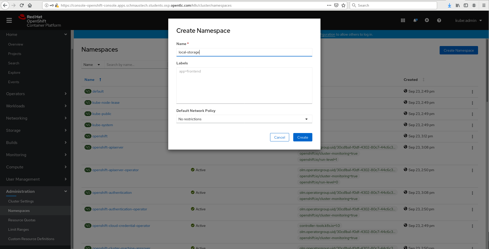
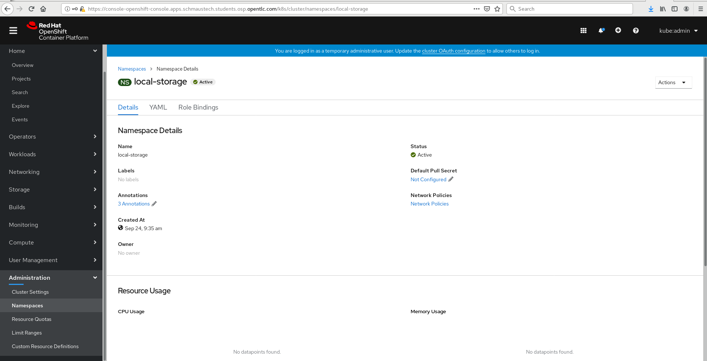
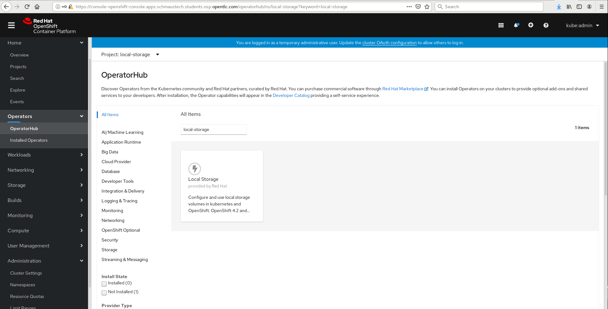
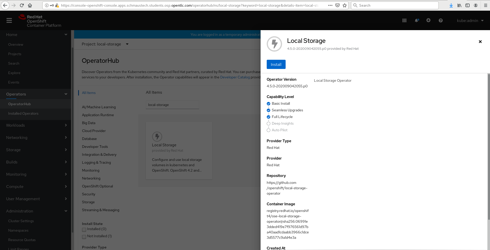
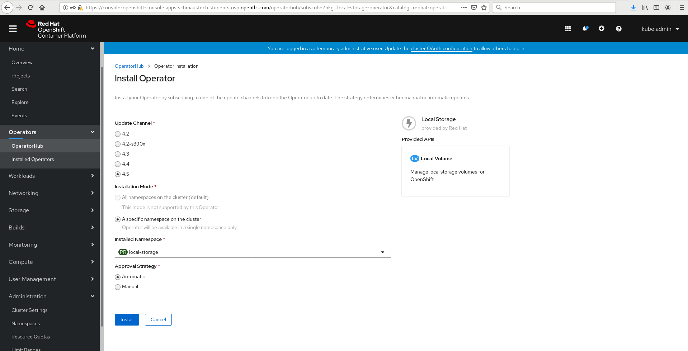

#**Deploy OCS On Cluster**

Now that we had added an additional worker node to our lab cluster environment we can deploy OpenShift Containerized Storage on top of the cluster.

Currently the lab from a node perspective should look like the following from a master/worker node count:

~~~bash
[cloud-user@provision ~]$ oc get nodes
NAME       STATUS   ROLES    AGE   VERSION
master-0   Ready    master   18h   v1.18.3+6c42de8
master-1   Ready    master   18h   v1.18.3+6c42de8
master-2   Ready    master   18h   v1.18.3+6c42de8
worker-0   Ready    worker   17h   v1.18.3+6c42de8
worker-1   Ready    worker   17h   v1.18.3+6c42de8
worker-2   Ready    worker   17h   v1.18.3+6c42de8
~~~

We need to attach a 100GB disk to each of our worker nodes in the lab environment.  Thankfully we have a little script to do this for us on the provisioning node.

~~~bash
[cloud-user@provision ~]$ ~/scripts/10_volume-attach.sh 
[cloud-user@provision ~]$ echo $?
0
~~~

We can validate that each node has the extra disk by using the debug container on the worker node:

~~~bash
[cloud-user@provision ~]$ oc debug node/worker-0
Starting pod/worker-0-debug ...
To use host binaries, run `chroot /host`
Pod IP: 10.20.0.200
If you don't see a command prompt, try pressing enter.
sh-4.2# 
~~~

Once inside the debug container we can look at the block devices available:

~~~bash
sh-4.2# chroot /host
sh-4.4# lsblk
NAME                         MAJ:MIN RM  SIZE RO TYPE MOUNTPOINT
vda                          252:0    0  100G  0 disk 
|-vda1                       252:1    0  384M  0 part /boot
|-vda2                       252:2    0  127M  0 part /boot/efi
|-vda3                       252:3    0    1M  0 part 
|-vda4                       252:4    0 99.4G  0 part 
| `-coreos-luks-root-nocrypt 253:0    0 99.4G  0 dm   /sysroot
`-vda5                       252:5    0   65M  0 part 
vdb                          252:16   0  100G  0 disk 
sh-4.4# exit
exit
sh-4.2# exit
exit

Removing debug pod ...
~~~

We can see from the output above that on worker-0 the new 100GB volume was attached as vdb.  Repeat the above steps to confirm that the remaining workers also have their 100GB vbd volume attached.

Now that we know the worker nodes have their disk we can proceed.  Before installing OCS we should first install the local-storage operator which we can configure the local disks on the worker nodes which in turn can be consumed by OCS as OSD devices.

Now that we have the local storage operator installed lets make a storage definition file that will use the disk device in each node:

~~~bash
[cloud-user@provision scripts]$ cat << EOF > ~/local-storage.yaml
apiVersion: local.storage.openshift.io/v1
kind: LocalVolume
metadata:
  name: local-block
  namespace: local-storage
spec:
  nodeSelector:
    nodeSelectorTerms:
    - matchExpressions:
        - key: cluster.ocs.openshift.io/openshift-storage
          operator: In
          values:
          - ""
  storageClassDevices:
    - storageClassName: localblock
      volumeMode: Block
      devicePaths:
        - /dev/vdb
EOF
~~~

Let's take a look at the file that it created:

~~~bash
[cloud-user@provision scripts]$ cat ~/local-storage.yaml
apiVersion: local.storage.openshift.io/v1
kind: LocalVolume
metadata:
  name: local-block
  namespace: local-storage
spec:
  nodeSelector:
    nodeSelectorTerms:
    - matchExpressions:
        - key: cluster.ocs.openshift.io/openshift-storage
          operator: In
          values:
          - ""
  storageClassDevices:
    - storageClassName: localblock
      volumeMode: Block
      devicePaths:
        - /dev/vdb
~~~

You'll see that this is set to create local volume on every host from the block device vdb where the selector key matches cluster.ocs.openshift.io/openshift-storage
