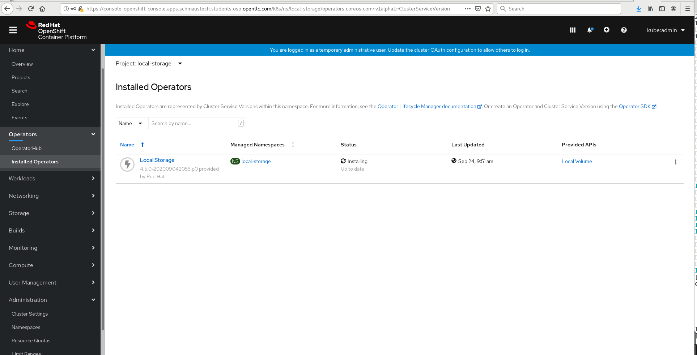
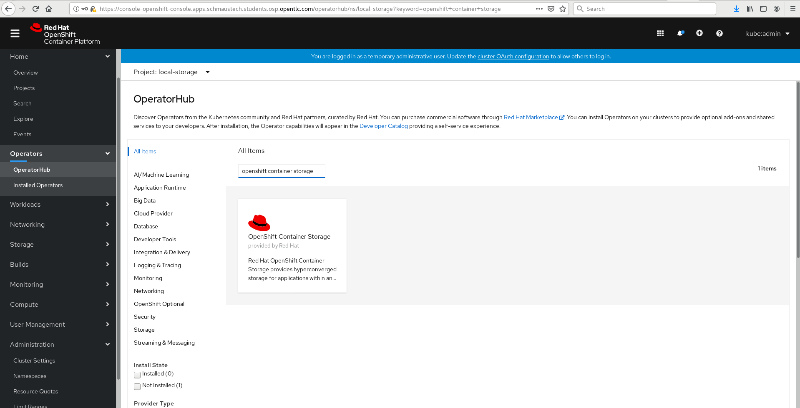
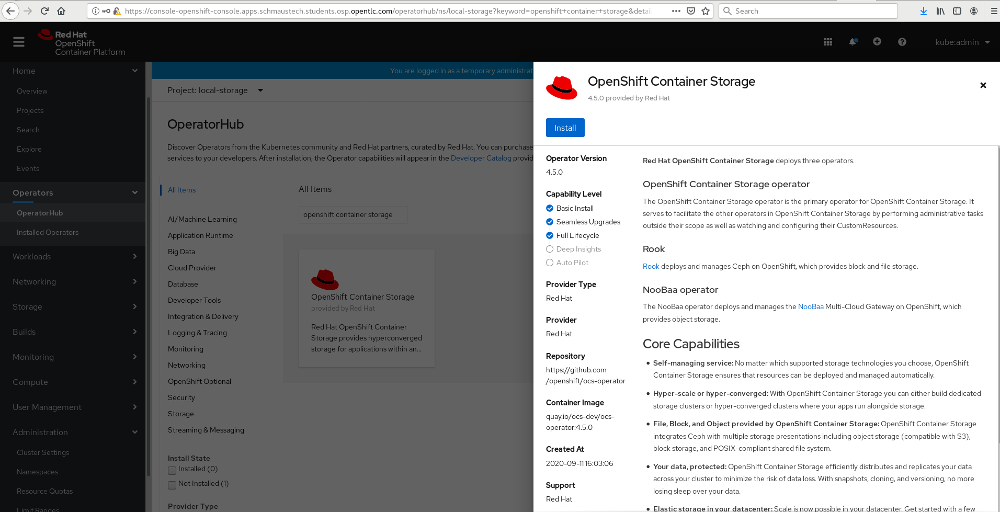
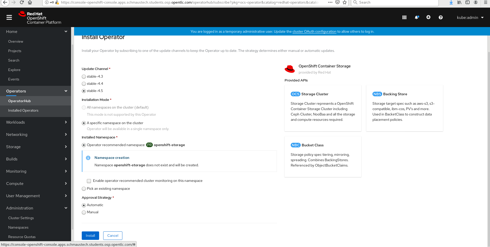
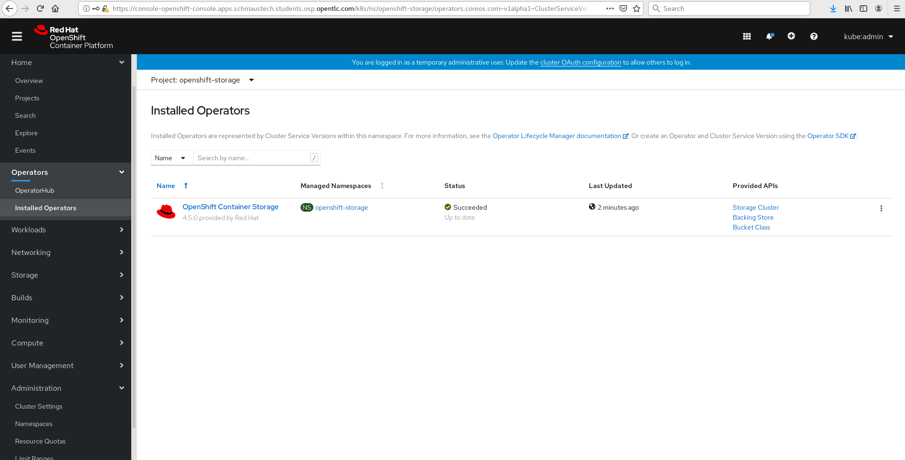
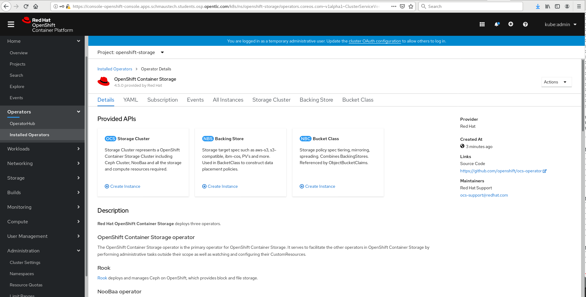
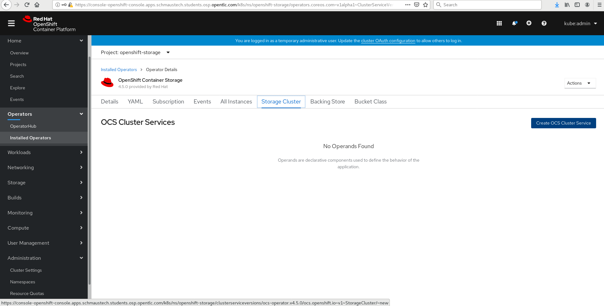
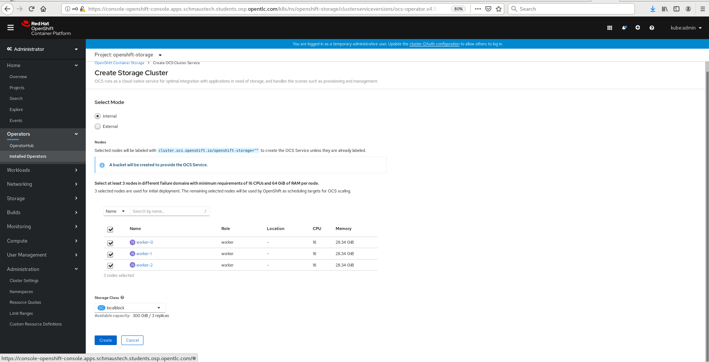
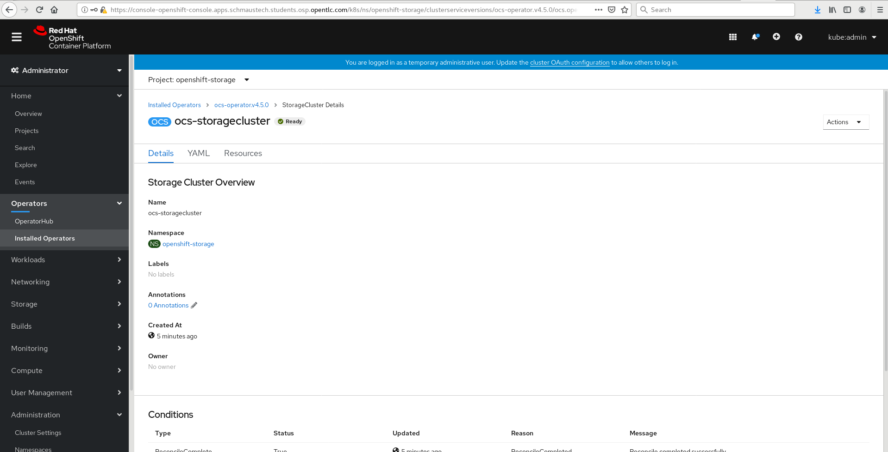
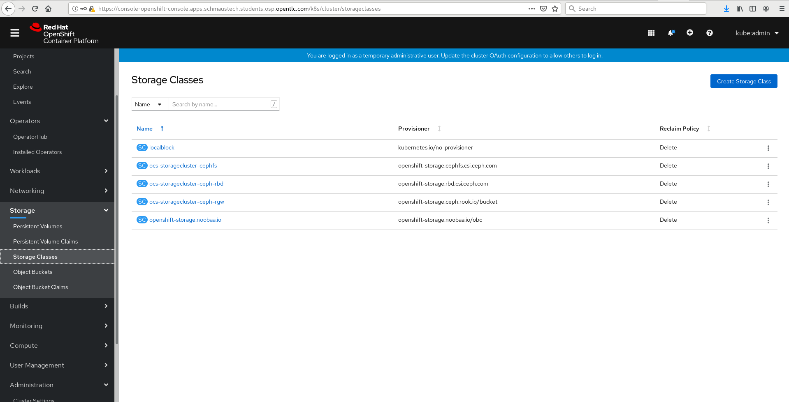

#**Deploy OCS On Cluster**

Now that we had added an additional worker node to our lab cluster environment we can deploy OpenShift Containerized Storage on top of the cluster.

Currently the lab from a node perspective should look like the following from a master/worker node count:

~~~bash
[cloud-user@provision ~]$ oc get nodes
NAME       STATUS   ROLES    AGE   VERSION
master-0   Ready    master   18h   v1.18.3+6c42de8
master-1   Ready    master   18h   v1.18.3+6c42de8
master-2   Ready    master   18h   v1.18.3+6c42de8
worker-0   Ready    worker   17h   v1.18.3+6c42de8
worker-1   Ready    worker   17h   v1.18.3+6c42de8
worker-2   Ready    worker   17h   v1.18.3+6c42de8
~~~

We need to attach a 100GB disk to each of our worker nodes in the lab environment.  Thankfully we have a little script to do this for us on the provisioning node.

~~~bash
[cloud-user@provision ~]$ ~/scripts/10_volume-attach.sh 
[cloud-user@provision ~]$ echo $?
0
~~~

We can validate that each node has the extra disk by using the debug container on the worker node:

~~~bash
[cloud-user@provision ~]$ oc debug node/worker-0
Starting pod/worker-0-debug ...
To use host binaries, run `chroot /host`
Pod IP: 10.20.0.200
If you don't see a command prompt, try pressing enter.
sh-4.2# 
~~~

Once inside the debug container we can look at the block devices available:

~~~bash
sh-4.2# chroot /host
sh-4.4# lsblk
NAME                         MAJ:MIN RM  SIZE RO TYPE MOUNTPOINT
vda                          252:0    0  100G  0 disk 
|-vda1                       252:1    0  384M  0 part /boot
|-vda2                       252:2    0  127M  0 part /boot/efi
|-vda3                       252:3    0    1M  0 part 
|-vda4                       252:4    0 99.4G  0 part 
| `-coreos-luks-root-nocrypt 253:0    0 99.4G  0 dm   /sysroot
`-vda5                       252:5    0   65M  0 part 
vdb                          252:16   0  100G  0 disk 
sh-4.4# exit
exit
sh-4.2# exit
exit

Removing debug pod ...
~~~

We can see from the output above that on worker-0 the new 100GB volume was attached as vdb.  Repeat the above steps to confirm that the remaining workers also have their 100GB vbd volume attached.

Now that we know the worker nodes have their disk we can proceed.  Before installing OCS we should first install the local-storage operator which we can configure the local disks on the worker nodes which in turn can be consumed by OCS as OSD devices.

The first step is to create a local storage namespace in the OpenShift console.  Navigate to Administration->Namespaces and click on the create namespace button.  Once the below dialogue appears enter in the namespace as local-storage.

After creating the namespace if we click on it we can get details about the namespace and also confirm that the namespace is active:

Now we can go to Operators->OperatorHub and search for the local storage operator in the catalog:

Select the local storage operator and click install:

This will bring up a dialogue of options for configuring the operator before deploying.  The defaults are usually accceptable but note that you can configure the version, installation mode, namespace where operator should run and the approval strategy.  Select the defaults and click install:

Once the operator is installed we can navigate to Operators->Installed Operators and see the local storage operator is installing which will eventually turn to a suceeded when complete.

We can also validate from the command line that the operator is installed and running as well:

~~~bash
[cloud-user@provision ~]$ oc get pods -n local-storage
local-storage-operator-57455d9cb4-4tj54   1/1     Running   0          10m
~~~

Now that we have the local storage operator installed lets make a storage definition file that will use the disk device in each node:

~~~bash
[cloud-user@provision scripts]$ cat << EOF > ~/local-storage.yaml
apiVersion: local.storage.openshift.io/v1
kind: LocalVolume
metadata:
  name: local-block
  namespace: local-storage
spec:
  nodeSelector:
    nodeSelectorTerms:
    - matchExpressions:
        - key: cluster.ocs.openshift.io/openshift-storage
          operator: In
          values:
          - ""
  storageClassDevices:
    - storageClassName: localblock
      volumeMode: Block
      devicePaths:
        - /dev/vdb
EOF
~~~

Let's take a look at the file that it created:

~~~bash
[cloud-user@provision scripts]$ cat ~/local-storage.yaml
apiVersion: local.storage.openshift.io/v1
kind: LocalVolume
metadata:
  name: local-block
  namespace: local-storage
spec:
  nodeSelector:
    nodeSelectorTerms:
    - matchExpressions:
        - key: cluster.ocs.openshift.io/openshift-storage
          operator: In
          values:
          - ""
  storageClassDevices:
    - storageClassName: localblock
      volumeMode: Block
      devicePaths:
        - /dev/vdb
~~~

You'll see that this is set to create local volume on every host from the block device vdb where the selector key matches cluster.ocs.openshift.io/openshift-storage.  If we had additional devices on the worker nodes for example: vdc and vdd, we would just list those below the devicePaths to also be incorporated into our configuration.

At this point we should label our nodes with the OCS storage label:

~~~bash
[cloud-user@provision ~]$ oc get nodes -l cluster.ocs.openshift.io/openshift-storage -o jsonpath='{range .items[*]}{.metadata.name}{"\n"}'
worker-0
worker-1
worker-2
~~~

Now we can go ahead and create the assests for this local-storage configuration using the local-storage.yaml we created above.

~~~bash
[cloud-user@provision ~]$ oc create -f ~/local-storage.yaml
localvolume.local.storage.openshift.io/local-block created
~~~

~~~bash
[cloud-user@provision ~]$ oc -n local-storage get pods
NAME                                      READY   STATUS              RESTARTS   AGE
local-block-local-diskmaker-626kf         0/1     ContainerCreating   0          8s
local-block-local-diskmaker-w5l5h         0/1     ContainerCreating   0          9s
local-block-local-diskmaker-xrxmh         0/1     ContainerCreating   0          9s
local-block-local-provisioner-9mhdq       0/1     ContainerCreating   0          9s
local-block-local-provisioner-lw9fm       0/1     ContainerCreating   0          9s
local-block-local-provisioner-xhf2x       0/1     ContainerCreating   0          9s
local-storage-operator-57455d9cb4-4tj54   1/1     Running             0          76m
~~~

~~~bash
[cloud-user@provision ~]$ oc -n local-storage get pods
NAME                                      READY   STATUS    RESTARTS   AGE
local-block-local-diskmaker-626kf         1/1     Running   0          21s
local-block-local-diskmaker-w5l5h         1/1     Running   0          22s
local-block-local-diskmaker-xrxmh         1/1     Running   0          22s
local-block-local-provisioner-9mhdq       1/1     Running   0          22s
local-block-local-provisioner-lw9fm       1/1     Running   0          22s
local-block-local-provisioner-xhf2x       1/1     Running   0          22s
local-storage-operator-57455d9cb4-4tj54   1/1     Running   0          76m
~~~
~~~bash
[cloud-user@provision ~]$ oc get pv
NAME                CAPACITY   ACCESS MODES   RECLAIM POLICY   STATUS      CLAIM   STORAGECLASS   REASON   AGE
local-pv-40d06fba   100Gi      RWO            Delete           Available           localblock              22s
local-pv-8aea98b7   100Gi      RWO            Delete           Available           localblock              22s
local-pv-e62c1b44   100Gi      RWO            Delete           Available           localblock              22s
~~~

~~~bash
[cloud-user@provision ~]$ oc get sc | grep localblock
localblock   kubernetes.io/no-provisioner   Delete          WaitForFirstConsumer   false                  53s
~~~

~~~bash
[cloud-user@provision ~]$ oc get pods -n openshift-storage
NAME                                  READY   STATUS    RESTARTS   AGE
noobaa-operator-5567695698-fc8t6      1/1     Running   0          10m
ocs-operator-6888cb5bdf-7w6ct         1/1     Running   0          10m
rook-ceph-operator-7bdb4cd5d9-qmggh   1/1     Running   5          10m
~~~

~~~bash
[cloud-user@provision ~]$ oc get pods -n openshift-storage
NAME                                            READY   STATUS              RESTARTS   AGE
csi-cephfsplugin-6mk78                          0/3     ContainerCreating   0          21s
csi-cephfsplugin-9fglq                          0/3     ContainerCreating   0          21s
csi-cephfsplugin-lsldk                          0/3     ContainerCreating   0          20s
csi-cephfsplugin-provisioner-5f8b66cc96-2z755   0/5     ContainerCreating   0          20s
csi-cephfsplugin-provisioner-5f8b66cc96-wsnsb   0/5     ContainerCreating   0          19s
csi-rbdplugin-b4qh5                             0/3     ContainerCreating   0          22s
csi-rbdplugin-k2fjg                             3/3     Running             0          23s
csi-rbdplugin-lnpgn                             0/3     ContainerCreating   0          22s
csi-rbdplugin-provisioner-66f66699c8-l9g9l      0/5     ContainerCreating   0          22s
csi-rbdplugin-provisioner-66f66699c8-v7ghq      0/5     ContainerCreating   0          21s
noobaa-operator-5567695698-fc8t6                1/1     Running             0          104m
ocs-operator-6888cb5bdf-7w6ct                   0/1     Running             0          104m
rook-ceph-mon-a-canary-587d74787d-wt247         0/1     ContainerCreating   0          8s
rook-ceph-mon-b-canary-6fd99d6865-fgcpx         0/1     ContainerCreating   0          3s
rook-ceph-operator-7bdb4cd5d9-qmggh             1/1     Running             5          104m
~~~

~~~bash
[cloud-user@provision ~]$ oc get pods -n openshift-storage
NAME                                                              READY   STATUS      RESTARTS   AGE
csi-cephfsplugin-6mk78                                            3/3     Running     0          5m1s
csi-cephfsplugin-9fglq                                            3/3     Running     0          5m1s
csi-cephfsplugin-lsldk                                            3/3     Running     0          5m
csi-cephfsplugin-provisioner-5f8b66cc96-2z755                     5/5     Running     0          5m
csi-cephfsplugin-provisioner-5f8b66cc96-wsnsb                     5/5     Running     0          4m59s
csi-rbdplugin-b4qh5                                               3/3     Running     0          5m2s
csi-rbdplugin-k2fjg                                               3/3     Running     0          5m3s
csi-rbdplugin-lnpgn                                               3/3     Running     0          5m2s
csi-rbdplugin-provisioner-66f66699c8-l9g9l                        5/5     Running     0          5m2s
csi-rbdplugin-provisioner-66f66699c8-v7ghq                        5/5     Running     0          5m1s
noobaa-core-0                                                     1/1     Running     0          2m38s
noobaa-db-0                                                       1/1     Running     0          2m38s
noobaa-endpoint-74b9ddcffc-pcg95                                  1/1     Running     0          41s
noobaa-operator-5567695698-fc8t6                                  1/1     Running     0          109m
ocs-operator-6888cb5bdf-7w6ct                                     1/1     Running     0          109m
rook-ceph-crashcollector-worker-0-6f9d88bcb6-79bmf                1/1     Running     0          3m23s
rook-ceph-crashcollector-worker-1-78b56fbfc5-lqsnl                1/1     Running     0          3m45s
rook-ceph-crashcollector-worker-2-77687b587b-j4h2h                1/1     Running     0          3m53s
rook-ceph-drain-canary-worker-0-5d9d5b4977-8tc62                  1/1     Running     0          2m43s
rook-ceph-drain-canary-worker-1-54644f5c94-mhnzt                  1/1     Running     0          2m44s
rook-ceph-drain-canary-worker-2-598f89d79f-gbcjc                  1/1     Running     0          2m41s
rook-ceph-mds-ocs-storagecluster-cephfilesystem-a-dd756495qt9n4   1/1     Running     0          2m6s
rook-ceph-mds-ocs-storagecluster-cephfilesystem-b-584dd7bc9hsr4   1/1     Running     0          2m5s
rook-ceph-mgr-a-848f8c59fd-ln6nz                                  1/1     Running     0          3m3s
rook-ceph-mon-a-5896d85b4f-tgc64                                  1/1     Running     0          3m54s
rook-ceph-mon-b-7695696f7d-9l565                                  1/1     Running     0          3m45s
rook-ceph-mon-c-5d95b547dc-gsjhj                                  1/1     Running     0          3m24s
rook-ceph-operator-7bdb4cd5d9-qmggh                               1/1     Running     5          109m
rook-ceph-osd-0-745d68b9df-qglsp                                  1/1     Running     0          2m45s
rook-ceph-osd-1-7946dc4cbc-sxm5w                                  1/1     Running     0          2m43s
rook-ceph-osd-2-85746d789-hhj5n                                   1/1     Running     0          2m42s
rook-ceph-osd-prepare-ocs-deviceset-0-data-0-vw4rb-q9kqg          0/1     Completed   0          2m59s
rook-ceph-osd-prepare-ocs-deviceset-1-data-0-znnlk-cghzf          0/1     Completed   0          2m58s
rook-ceph-osd-prepare-ocs-deviceset-2-data-0-7wdbq-r26b8          0/1     Completed   0          2m58s
rook-ceph-rgw-ocs-storagecluster-cephobjectstore-a-549f6f742cgb   1/1     Running     0          87s
rook-ceph-rgw-ocs-storagecluster-cephobjectstore-b-9b695d7q8tml   1/1     Running     0          83s
~~~

~~~bash
[cloud-user@provision ~]$ oc get storageclass
NAME                          PROVISIONER                             RECLAIMPOLICY   VOLUMEBINDINGMODE      ALLOWVOLUMEEXPANSION   AGE
localblock                    kubernetes.io/no-provisioner            Delete          WaitForFirstConsumer   false                  115m
ocs-storagecluster-ceph-rbd   openshift-storage.rbd.csi.ceph.com      Delete          Immediate              true                   5m36s
ocs-storagecluster-ceph-rgw   openshift-storage.ceph.rook.io/bucket   Delete          Immediate              false                  5m36s
ocs-storagecluster-cephfs     openshift-storage.cephfs.csi.ceph.com   Delete          Immediate              true                   5m36s
openshift-storage.noobaa.io   openshift-storage.noobaa.io/obc         Delete          Immediate              false                  65s
~~~
