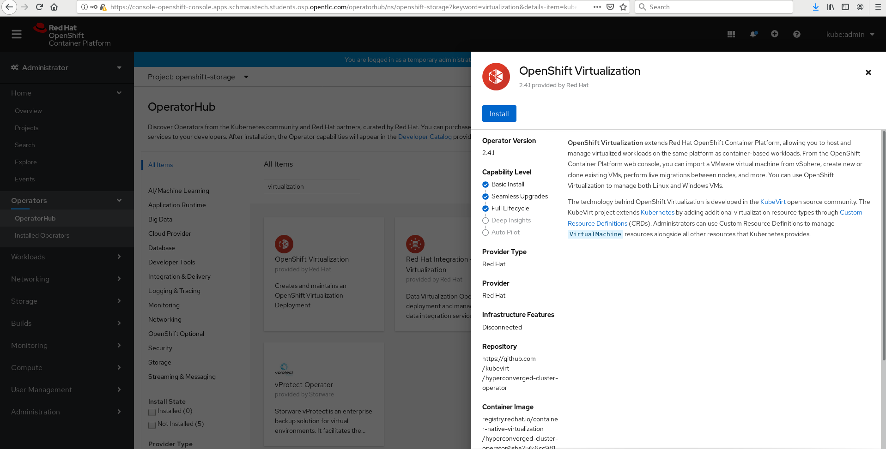
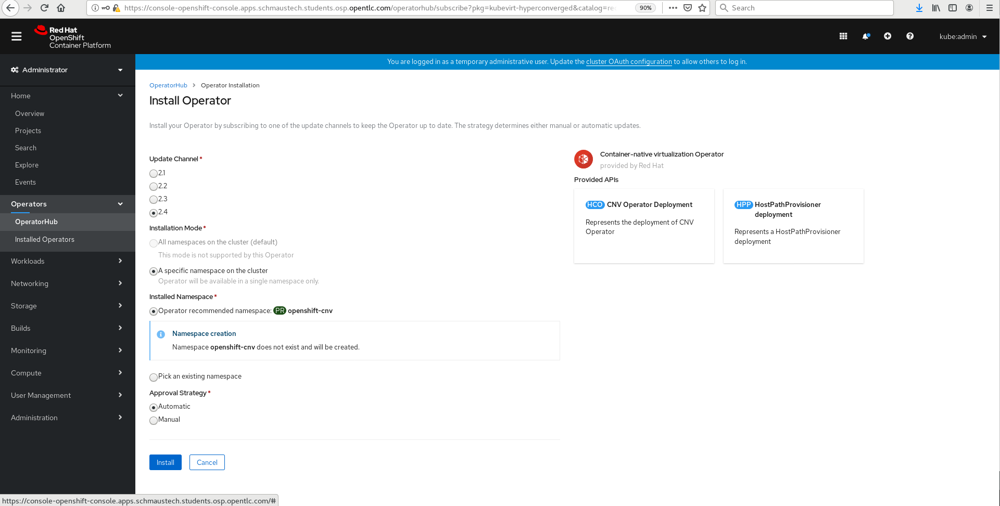
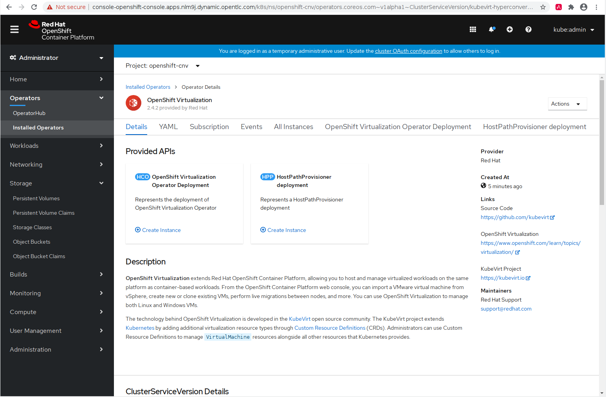
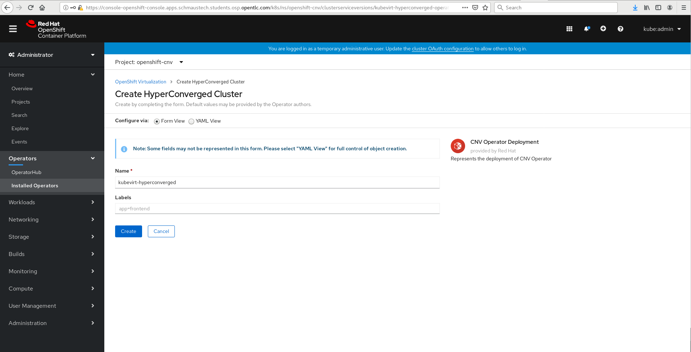
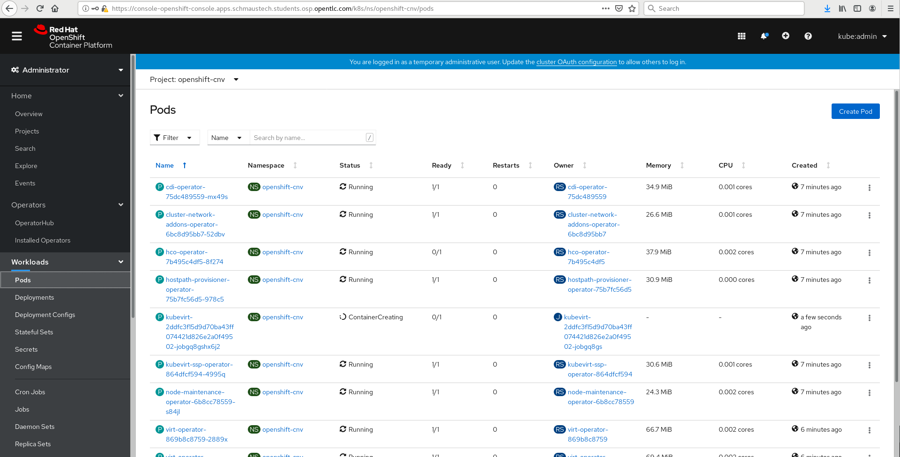
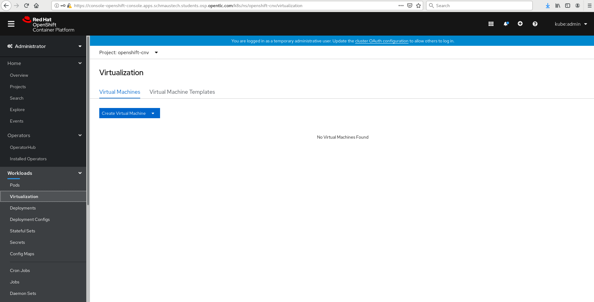

# **Deploy OpenShift Virtualization**

This section of the lab will focus on installing and configuring OpenShift virtualization to enable the OpenShift cluster to run virtual machines.

The mechanism for installation is to utilise the operator model and deploy via the OpenShift Operator Hub (Marketplace) in the web-console. Note, it's entirely possible to deploy via the CLI should you wish to do so, but we're not documenting that mechanism here.

Next, navigate to the top-level '**Operators**' menu entry, and select '**OperatorHub**'. This lists all of the available operators that you can install from the Red Hat Marketplace. Simply start typing '**virtualization**' in the search box and you should see an entry for "OpenShift Virtualization". Simply select it and you'll see a window that looks like the following:



Next you'll want to select the 'Install' button, which will take you to a second window where you'll be creating an 'Operator Subscription'. Leave the defaults here as they'll automatically select the latest version of OpenShift virtualisation and will allow the software to be installed automatically:



Make sure that the namespace it will be installed to is "**openshift-cnv**" - it should be the default entry, but make sure. When you're ready, press the **'Install'** button. After a minute or two you'll see that the subscription has been configured successfully:


Next we need to actually deploy all of the CNV components that this subscription provides. Select the "**OpenShift Virtualization**" link under the '**Name**' column, and you'll be presented with the following:



From here, select '**Create Instance**' on the '**OpenShift Virtualization Operator Deployment**' button; this will deploy all of the necessary components that are required to support OpenShift virtualisation. The next page will show you the operators details - we can leave this as the defaults and select '**Create**' at the bottom.



Whilst this does its thing, you can move to the '**Workloads**' --> '**Pods**' menu entry and watch it start all of its resources (select "Pending" from the pods filter):



You can also watch via the CLI:

```bash
[lab-user@provision ~]$ watch -n2 'oc get pods -n openshift-cnv'
(...)
```

> **NOTE**: It may take a few minutes for the pods to start up properly. Press **Ctrl+C** to exit the watch command.

During this process you will see a lot of pods create and terminate, which will look something like the following depending on when you view it; it's always changing:

```bash
Every 2.0s: oc get pods -n openshift-cnv                                                                                                                                       provision: Fri Sep 25 14:59:01 2020

NAME                                                  READY   STATUS    RESTARTS   AGE
bridge-marker-65kv5                                   1/1     Running   0          5m13s
bridge-marker-9ckff                                   1/1     Running   0          5m10s
bridge-marker-fk96v                                   1/1     Running   0          5m12s
bridge-marker-kt4sw                                   1/1     Running   0          5m12s
bridge-marker-m68cs                                   1/1     Running   0          5m9s
bridge-marker-sklxs                                   1/1     Running   0          5m10s
cdi-apiserver-7c4566c98c-4qkph                        1/1     Running   0          5m15s
cdi-deployment-79fdcfdccb-prhfc                       1/1     Running   1          5m13s
cdi-operator-75dc489559-mx49s                         1/1     Running   1          12m
cdi-uploadproxy-5d4cc54b4c-ntj2x                      1/1     Running   0          5m12s
cluster-network-addons-operator-6bc8d95bb7-52dbv      1/1     Running   0          12m
hco-operator-7b495c4df5-8f274                         1/1     Running   0          12m
hostpath-provisioner-operator-75b7fc56d5-978c5        1/1     Running   0          12m
kube-cni-linux-bridge-plugin-4kf8s                    1/1     Running   0          5m13s
kube-cni-linux-bridge-plugin-62qpw                    1/1     Running   0          5m13s
kube-cni-linux-bridge-plugin-d6jmq                    1/1     Running   0          5m13s
kube-cni-linux-bridge-plugin-kc26d                    1/1     Running   0          5m15s
kube-cni-linux-bridge-plugin-nsb6m                    1/1     Running   0          5m14s
kube-cni-linux-bridge-plugin-v96sd                    1/1     Running   0          5m14s
kubemacpool-mac-controller-manager-6f9c447bbd-4m9ch   1/1     Running   0          5m9s
kubevirt-node-labeller-bbw9z                          1/1     Running   0          4m38s
kubevirt-node-labeller-g7c95                          1/1     Running   0          4m38s
kubevirt-node-labeller-vqxdt                          1/1     Running   0          4m39s
kubevirt-ssp-operator-864dfcf594-4995q                1/1     Running   0          12m
nmstate-handler-5cn7t                                 1/1     Running   0          5m1s
nmstate-handler-5hqwb                                 1/1     Running   0          5m
nmstate-handler-7cpj5                                 1/1     Running   0          5m
nmstate-handler-9mb8q                                 1/1     Running   0          5m
nmstate-handler-cr5vx                                 1/1     Running   0          5m1s
nmstate-handler-kppf6                                 1/1     Running   0          5m2s
node-maintenance-operator-6b8cc78559-s84jl            1/1     Running   0          12m
ovs-cni-amd64-8499s                                   1/1     Running   1          4m53s
ovs-cni-amd64-f2zr5                                   1/1     Running   0          4m53s
ovs-cni-amd64-hm9c5                                   1/1     Running   2          4m57s
ovs-cni-amd64-kbcrx                                   1/1     Running   0          4m57s
ovs-cni-amd64-kn92k                                   1/1     Running   1          4m55s
ovs-cni-amd64-lkn2v                                   1/1     Running   0          4m53s
virt-api-7686f978db-mxbvd                             1/1     Running   0          4m24s
virt-api-7686f978db-p9zl8                             1/1     Running   0          4m22s
virt-controller-7d567db8c6-jpd74                      1/1     Running   0          3m32s
virt-controller-7d567db8c6-kld5f                      1/1     Running   0          3m33s
virt-handler-f5946                                    1/1     Running   0          3m32s
virt-handler-q9m2n                                    1/1     Running   0          3m32s
virt-handler-tdt5p                                    1/1     Running   0          3m33s
virt-operator-869b8c8759-2889x                        1/1     Running   0          11m
virt-operator-869b8c8759-xn7k4                        1/1     Running   2          11m
virt-template-validator-5d9bbfbcc7-6v4qh              1/1     Running   0          4m46s
```

This will continue for some time, depending on your environment.

You will know the process is complete when you see in the CLI that the operator installation has been successful by running the following command and getting the "**Succeeded**" output:

```bash
[lab-user@provision ~]$ oc get csv -n openshift-cnv
NAME                                      DISPLAY                    VERSION   REPLACES   PHASE
kubevirt-hyperconverged-operator.v2.4.1   OpenShift Virtualization   2.4.1                Succeeded
```

If you do not see `Succeeded` in the `PHASE` column then the deployment may still be progressing, or has failed. You will not be able to proceed until the installation has been successful. Once the `PHASE` changes to `Succeeded` you can validate that the required resources and the additional components have been deployed across the nodes. First let's check the pods deployed in the `openshift-cnv` namespace:

```bash
[lab-user@provision ~]$ oc get pods -n openshift-cnv
NAME                                                  READY   STATUS    RESTARTS   AGE
bridge-marker-65kv5                                   1/1     Running   0          6m12s
bridge-marker-9ckff                                   1/1     Running   0          6m9s
bridge-marker-fk96v                                   1/1     Running   0          6m11s
bridge-marker-kt4sw                                   1/1     Running   0          6m11s
bridge-marker-m68cs                                   1/1     Running   0          6m8s
bridge-marker-sklxs                                   1/1     Running   0          6m9s
cdi-apiserver-7c4566c98c-4qkph                        1/1     Running   0          6m14s
cdi-deployment-79fdcfdccb-prhfc                       1/1     Running   1          6m12s
cdi-operator-75dc489559-mx49s                         1/1     Running   2          13m
cdi-uploadproxy-5d4cc54b4c-ntj2x                      1/1     Running   0          6m11s
(...)
```

> **NOTE**: All pods shown from this command should be in the `Running` state. You will have many different types, the above snippet is just an example of the output at one point in time, you may have more or less at any one point. Below we discuss some of the pod types and what they do.

Together, all of these pods are responsible for various functions of running a virtual machine on-top of OpenShift/Kubernetes. See the table below that describes some of the various different pod types and their function:

Pod Name                                                                                           | Pod Responsibilities
-------------------------------------------------------------------------------------------------- | ---------------------------------------------------------------------------------------------------------------------------------------------------------------------------------------------------------------
_[bridge-marker](https://github.com/kubevirt/bridge-marker)_                                       | Marks network bridges as available node resources.
_[cdi-_](<https://github.com/kubevirt/containerized-data-importer)*>                               | The Containerised Data Importer (CDI) is a Kubernetes extension to populate PVCs with VM disk images or other data. CDI pods allow OpenShift virtualisation to import, upload and clone Virtual Machine images.
_[cluster-network-addons-operator](https://github.com/kubevirt/cluster-network-addons-operator)_   | Allows the installation of additional networking plugins.
_[hco-operator](https://github.com/kubevirt/hyperconverged-cluster-operator)_                      | Allows users to deploy and configure multiple operators in a single operator and via a single entry point. An "operator of operators."
_[hostpath-provisioner-operator](https://github.com/kubevirt/hostpath-provisioner-operator)_       | Operator that manages the hostpath-provisioner, which provisions storage on network filesystems mounted on the host.
_[kube-cni-linux-bridge-plugin](https://github.com/containernetworking/plugins)_                   | CNI Plugin to create a network bridge and add a host and container to it.
_kubemacpool-mac-controller-manager_                                                               | Allocation of MAC addresses from a pool to secondary interfaces.
_[kubevirt-node-labeller](https://github.com/kubevirt/node-labeller)_                              | Creates node labels based on CPU information.
_[kubevirt-ssp-operator](https://github.com/MarSik/kubevirt-ssp-operator)_                         | Scheduling, Scale and Performance operator for OpenShift. The Hyperconverged Cluster Operator automatically installs the SSP operator when deploying.
_nmstate-handler_                                                                                  | Deploys NMState which allows network administrators to manage host networking settings in a declarative manner.
_[node-maintenance-operator](https://github.com/kubevirt/cluster-network-addons-operator#nmstate)_ | Operator that allows the administrator to deploy the NMState State Controller.
_[ovs-cni](https://github.com/kubevirt/ovs-cni)_                                                   | The Open vSwitch CNI plugin.
_[virt-api](https://github.com/kubevirt/kubevirt/tree/master/pkg/virt-api)_                        | Kubernetes Virtualization API and runtime in order to define and manage virtual machines
_[virt-controller](https://kubernetes.io/blog/2018/05/22/getting-to-know-kubevirt/)_               | The operator that's responsible for cluster-wide virtualisation functionality
_[virt-handler](https://kubernetes.io/blog/2018/05/22/getting-to-know-kubevirt/)_                  | Tracks changes to a VM's state.
_[virt-template-validator](https://kubernetes.io/blog/2018/05/22/getting-to-know-kubevirt/)_       | Add-on to check the annotations on templates and reject them if invalid.

There's also a few custom resources that get defined too, for example the `NodeNetworkState` (`nns` for short) definitions that can be used with the `nmstate-handler` pods to ensure that the NetworkManager state on each node is configured as required, e.g. for defining interfaces/bridges on each of the machines for connectivity for both the physical machine itself and for providing network access for pods (and virtual machines) within OpenShift/Kubernetes:

```bash
[lab-user@provision ~]$ oc get nns -A
NAME                                 AGE
master-0.nlm9j.dynamic.opentlc.com   117s
master-1.nlm9j.dynamic.opentlc.com   2m
master-2.nlm9j.dynamic.opentlc.com   2m8s
worker-0.nlm9j.dynamic.opentlc.com   2m14s
worker-1.nlm9j.dynamic.opentlc.com   2m11s
worker-2.nlm9j.dynamic.opentlc.com   2m15s

[lab-user@provision ~]$ oc get nns/worker-2.$GUID.dynamic.opentlc.com -o yaml
apiVersion: nmstate.io/v1alpha1
kind: NodeNetworkState
metadata:
  creationTimestamp: "2020-09-25T18:54:17Z"
  generation: 1
(...)
  name: worker-2
(...)
   interfaces:
- ipv4:
        enabled: false
      ipv6:
        enabled: false
      mac-address: 92:0a:eb:3f:f2:4e
      mtu: 1400
      name: br-ext
      state: down
      type: ovs-interface
    - ipv4:
        address:
        - ip: 172.22.0.48
          prefix-length: 24
        auto-dns: true
        auto-gateway: true
        auto-routes: true
        dhcp: true
        enabled: true
      ipv6:
        address:
        - ip: fe80::5f23:c69d:ee2b:88a2
          prefix-length: 64
        auto-dns: true
        auto-gateway: true
        auto-routes: true
        autoconf: true
        dhcp: true
        enabled: true
      mac-address: DE:AD:BE:EF:00:52
      mtu: 1500
      name: ens3
      state: up
      type: ethernet

(...)
```

Here you can see the current state of the node (some of the output has been cut), the interfaces attached, and their physical/logical addresses. Before we move on from this lab we need to ensure that we have setup a proper bridge for our VMs to get access to the network. We can do this by creating a NetworkNodeConfigurationPolicy (nncp):

```bash
[lab-user@provision ocp]$ cat << EOF | oc apply -f -
apiVersion: nmstate.io/v1alpha1
kind: NodeNetworkConfigurationPolicy
metadata:
  name: worker-brext-ens3
spec:
  nodeSelector:
    node-role.kubernetes.io/worker: ""
  desiredState:
    interfaces:
      - name: brext
        description: brext with ens3
        type: linux-bridge
        state: up
        ipv4:
          enabled: true
          dhcp: true
        bridge:
          options:
            stp:
              enabled: false
          port:
            - name: ens3
EOF
nodenetworkconfigurationpolicy.nmstate.io/worker-brext-ens3 created
```

The above policy will attache a brext bridge to the external network interface ens3. We can watch the progress by running the following:

```bash
[lab-user@provision ocp]$ oc get nnce
NAME                                                   STATUS
master-0.hhnfk.dynamic.opentlc.com.worker-brext-ens3   NodeSelectorNotMatching
master-1.hhnfk.dynamic.opentlc.com.worker-brext-ens3   NodeSelectorNotMatching
master-2.hhnfk.dynamic.opentlc.com.worker-brext-ens3   NodeSelectorNotMatching
worker-0.hhnfk.dynamic.opentlc.com.worker-brext-ens3   ConfigurationProgressing
worker-1.hhnfk.dynamic.opentlc.com.worker-brext-ens3   ConfigurationProgressing
worker-2.hhnfk.dynamic.opentlc.com.worker-brext-ens3   ConfigurationProgressing

[lab-user@provision ocp]$ oc get nnce
NAME                                                   STATUS
master-0.hhnfk.dynamic.opentlc.com.worker-brext-ens3   NodeSelectorNotMatching
master-1.hhnfk.dynamic.opentlc.com.worker-brext-ens3   NodeSelectorNotMatching
master-2.hhnfk.dynamic.opentlc.com.worker-brext-ens3   NodeSelectorNotMatching
worker-0.hhnfk.dynamic.opentlc.com.worker-brext-ens3   SuccessfullyConfigured
worker-1.hhnfk.dynamic.opentlc.com.worker-brext-ens3   SuccessfullyConfigured
worker-2.hhnfk.dynamic.opentlc.com.worker-brext-ens3   SuccessfullyConfigured
```

If we ssh into one of the worker nodes we can see that indeed a brext interface has been created:

```bash
[lab-user@provision scripts]$ ssh core@worker-0.$GUID.dynamic.opentlc.com
The authenticity of host 'worker-0.npxjr.dynamic.opentlc.com (10.20.0.200)' can't be established.
ECDSA key fingerprint is SHA256:t2FyrDPH2fVqi0RQDV8p2zrhIY+zvITgysaNutHASHU.
Are you sure you want to continue connecting (yes/no/[fingerprint])? yes
Warning: Permanently added 'worker-0.npxjr.dynamic.opentlc.com' (ECDSA) to the list of known hosts.
Red Hat Enterprise Linux CoreOS 45.82.202009181447-0
  Part of OpenShift 4.5, RHCOS is a Kubernetes native operating system
  managed by the Machine Config Operator (`clusteroperator/machine-config`).

WARNING: Direct SSH access to machines is not recommended; instead,
make configuration changes via `machineconfig` objects:
  https://docs.openshift.com/container-platform/4.5/architecture/architecture-rhcos.html

---
Last login: Fri Oct 16 00:01:04 2020 from 10.20.0.2
[core@worker-0 ~]$ ip a show brext
46: brext: <BROADCAST,MULTICAST,UP,LOWER_UP> mtu 8942 qdisc noqueue state UP group default qlen 1000
    link/ether ba:dc:0f:fe:e0:50 brd ff:ff:ff:ff:ff:ff
    inet 10.20.0.200/24 brd 10.20.0.255 scope global dynamic noprefixroute brext
       valid_lft 43013sec preferred_lft 43013sec

[core@worker-0 ~]$ exit
logout
Connection to worker-0.nlm9j.dynamic.opentlc.com closed.
```
(Make sure to log out of the worker before proceeding.)

Once the bridges have been successfully configured we can then add our network attachment definition which will allow our VMs to consume that bridge interface:

```bash
[lab-user@provision ocp]$ cat << EOF | oc apply -f -
apiVersion: "k8s.cni.cncf.io/v1"
kind: NetworkAttachmentDefinition
metadata:
  name: brext
  annotations:
    k8s.v1.cni.cncf.io/resourceName: bridge.network.kubevirt.io/brext
spec:
  config: '{
    "cniVersion": "0.3.1",
    "name": "brext",
    "plugins": [
      {
        "type": "cnv-bridge",
        "bridge": "brext"
      },
      {
        "type": "tuning"
      }
    ]
  }'
EOF
networkattachmentdefinition.k8s.cni.cncf.io/tuning-bridge-fixed created
```

Once those have been applied we can now move forward in the lab.

## Viewing the OpenShift virtualisation Dashboard

When OpenShift virtualisation is deployed it adds additional components to OpenShift's web-console so you can interact with objects and custom resources defined by OpenShift virtualisation, including `VirtualMachine` types. You can now navigate to "**Workloads**" --> "**Virtualization**" on the left-hand side panel and you should see the new snap-in component for OpenShift virtualisation but with no Virtual Machines running.



> **NOTE**: Please don't try and create any virtual machines just yet, we'll get to that shortly!

Ready to test out this cool new environment and deploy some VM workloads onto your new cluster? Well, that's just what we are going to do in the next lab: [Running Workloads in the Environment](https://github.com/RHFieldProductManagement/baremetal-ipi-lab/blob/master/09-workloads.md)!
