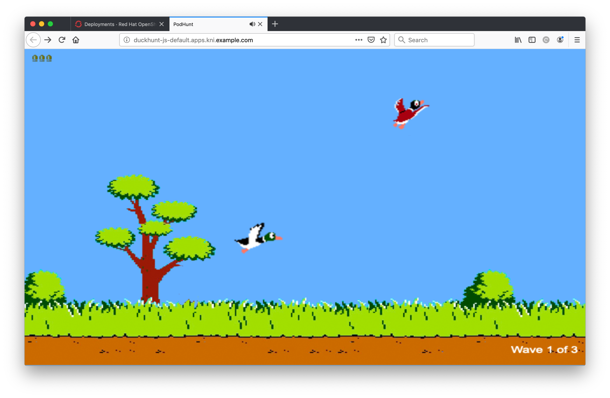
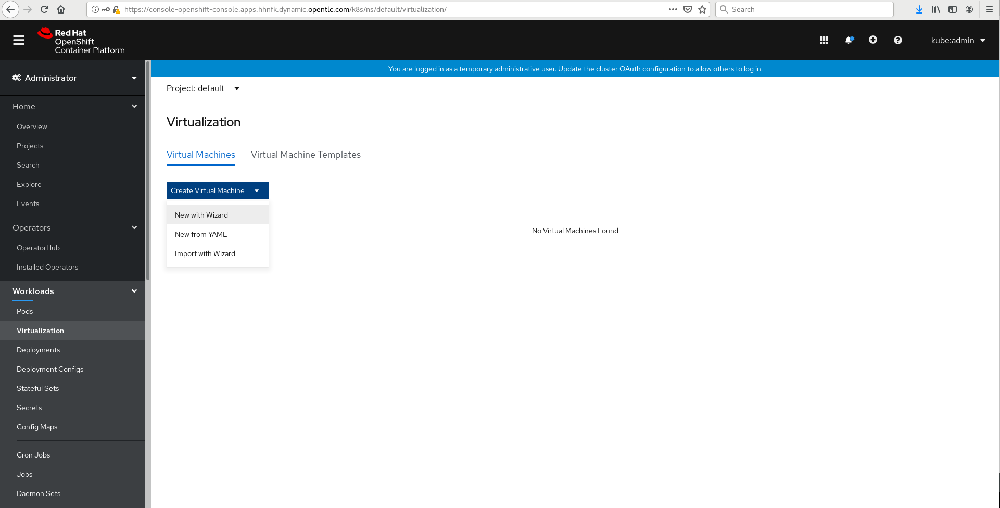
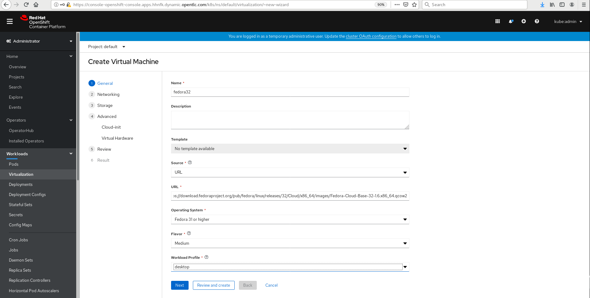
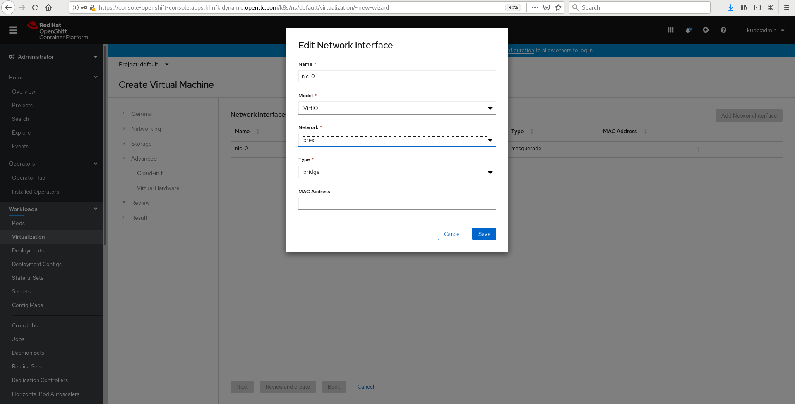
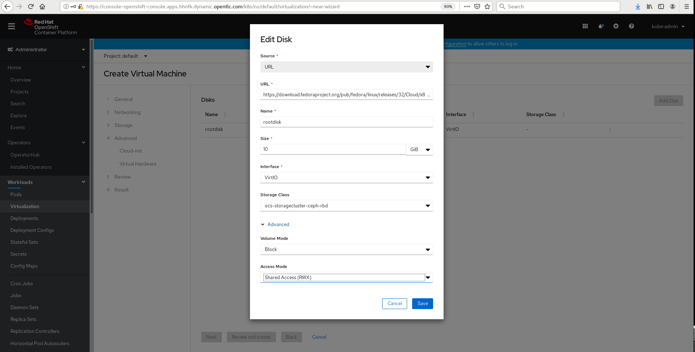
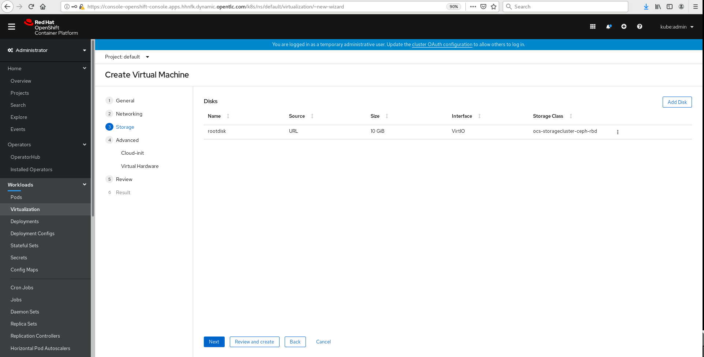
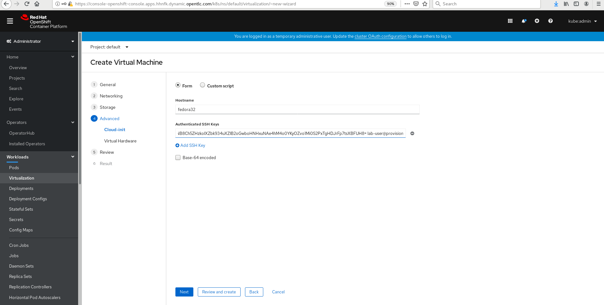
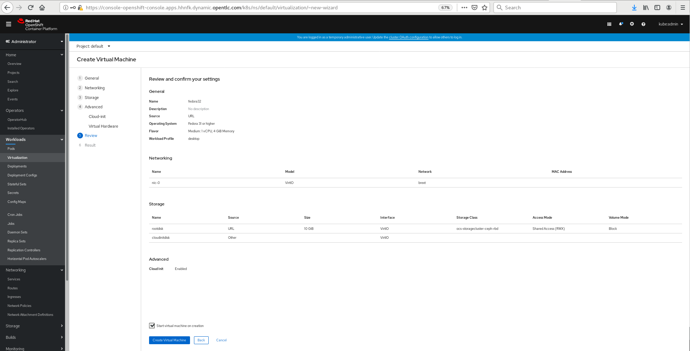
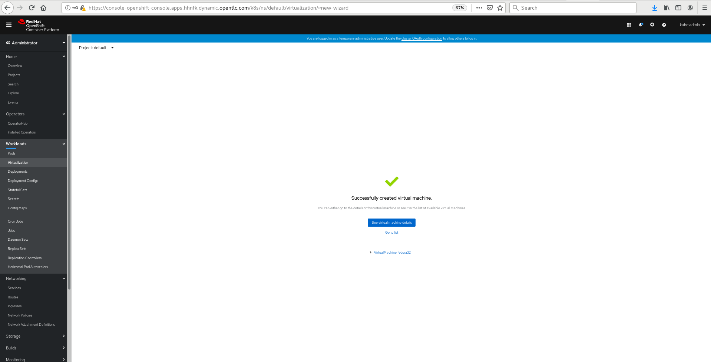

# **Running Workloads in the Environment**

Let's get into actually testing some workloads on our environment... we've spent all of this time building it up but we haven't even proven that it's working properly yet! In this section we're going to be deploying some pods as well as deploying a VM using OpenShift virtualization.

## Deploying a Container

OK, so this is likely something that you've all done before, and it's hardly very exciting, but let's have a little bit of fun. Let's deploy a nifty little application inside of a pod and use it to verify that the OpenShift cluster is functioning properly; this will involve building an application from source and exposing it to your web-browser. We'll use the s2i (source to image) container type:

~~~bash
[lab-user@provision ~]$ oc project default
Already on project "default" on server "https://api.schmaustech.dynamic.opentlc.com:6443".
[lab-user@provision ~]$ oc new-app nodeshift/centos7-s2i-nodejs:12.x~https://github.com/vrutkovs/DuckHunt-JS
--> Found container image 5b0b75b (11 months old) from Docker Hub for "nodeshift/centos7-s2i-nodejs:12.x"

    Node.js 12.12.0 
    --------------- 
    Node.js  available as docker container is a base platform for building and running various Node.js  applications and frameworks. Node.js is a platform built on Chrome's JavaScript runtime for easily building fast, scalable network applications. Node.js uses an event-driven, non-blocking I/O model that makes it lightweight and efficient, perfect for data-intensive real-time applications that run across distributed devices.

    Tags: builder, nodejs, nodejs-12.12.0

    * An image stream tag will be created as "centos7-s2i-nodejs:12.x" that will track the source image
    * A source build using source code from https://github.com/vrutkovs/DuckHunt-JS will be created
      * The resulting image will be pushed to image stream tag "duckhunt-js:latest"
      * Every time "centos7-s2i-nodejs:12.x" changes a new build will be triggered

--> Creating resources ...
    buildconfig.build.openshift.io "duckhunt-js" created
    deployment.apps "duckhunt-js" created
    service "duckhunt-js" created
--> Success
    Build scheduled, use 'oc logs -f bc/duckhunt-js' to track its progress.
    Application is not exposed. You can expose services to the outside world by executing one or more of the commands below:
     'oc expose svc/duckhunt-js' 
    Run 'oc status' to view your app.
~~~

Now our application will build from source, you can watch it happen with:

~~~bash
[lab-user@provision ~]$ oc logs duckhunt-js-1-build -f
Caching blobs under "/var/cache/blobs".
Getting image source signatures
Copying blob sha256:d8d02d45731499028db01b6fa35475f91d230628b4e25fab8e3c015594dc3261
Copying blob sha256:a11069b6e24573a516c9d542d7ed33adc115ebcde49101037d153958d3bc2e01
(...)
Writing manifest to image destination
Storing signatures
Successfully pushed image-registry.openshift-image-registry.svc:5000/default/duckhunt-js@sha256:a2eff4eca82019b2752bfbe7ab0f7dcb6875cc9a6ec16b09f351dd933612300b
Push successful
~~~

Now you can check if the Duckhunt pod has finished building and is running:

~~~bash
[lab-user@provision ~]$ oc get pods
NAME                          READY   STATUS      RESTARTS   AGE
duckhunt-js-1-build           0/1     Completed   0          2m21s
duckhunt-js-cb885554b-qqmw2   1/1     Running     0          39s
~~~

Now expose the application (via the service) so we can route to it from the outside...

~~~bash
[lab-user@provision ~]$ oc expose svc/duckhunt-js
route.route.openshift.io/duckhunt-js exposed

[lab-user@provision ~]$ oc get route duckhunt-js
NAME          HOST/PORT                                                       PATH   SERVICES      PORT       TERMINATION   WILDCARD
duckhunt-js   duckhunt-js-default.apps.schmaustech.dynamic.opentlc.com          duckhunt-js   8080-tcp                 None
~~~

Now you should be able to open up the application in the same browser that you're using for access to the OpenShift console. Copy and paste the host address from above and you should now be able to have a quick play with this... good luck ;-

Now, if you can tear yourself away from the game, let's build a VM...

## Deploying a Virtual Machine

If you recall back in the previous deploy OpenShift virtualization lab we went ahead and installed the OpenShift virtualization operater and created a virtualization cluster.  Further we went ahead and configured an external bridge so that are virtual machines can be connected to the outside network.  Therefore we are now at the point where we can launch a virtual machine.  To do this we will use the OpenShift Web Console and navigate to Workloads->Virtualization:

Select the New with Wizard option and the workflow for creating a new virtual machine will be brought up:

**Success**, we're done! Congratulations... if you've made it this far you've deployed KNI from the ground up, deployed Ceph via Rook, Container Native Virtualisation (CNV), and tested the solution with pods and VM's via the CLI and the OpenShift dashboard! I'd like to ***thank you*** for attending this lab; I hope that it was a valuable use of your time and that your learnt a lot from doing it. Please do let us know if there's anything else we can do to support you! There's also a CNV-based lab here at Red Hat Tech Exchange if you're keen on exploring it further.
