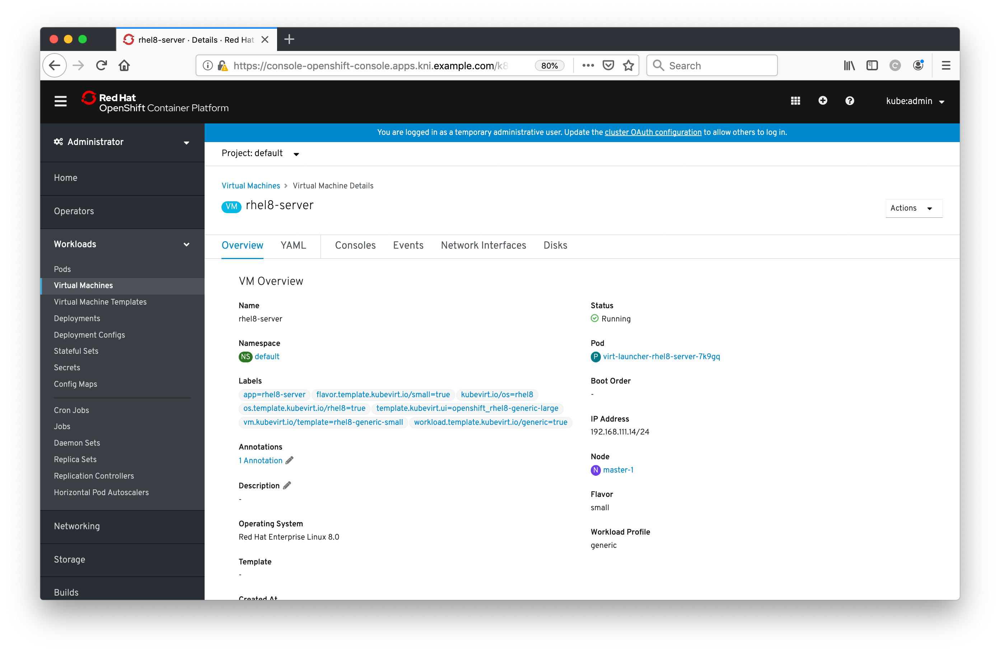
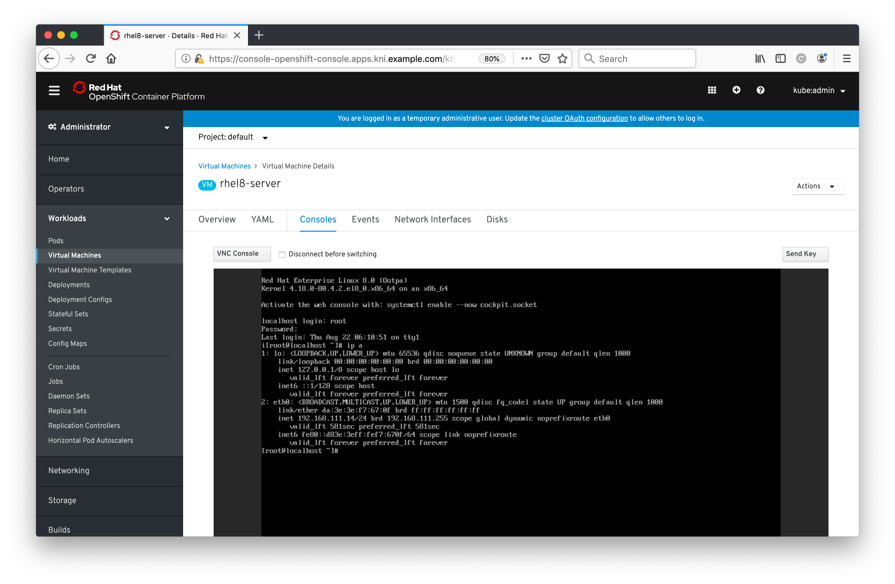
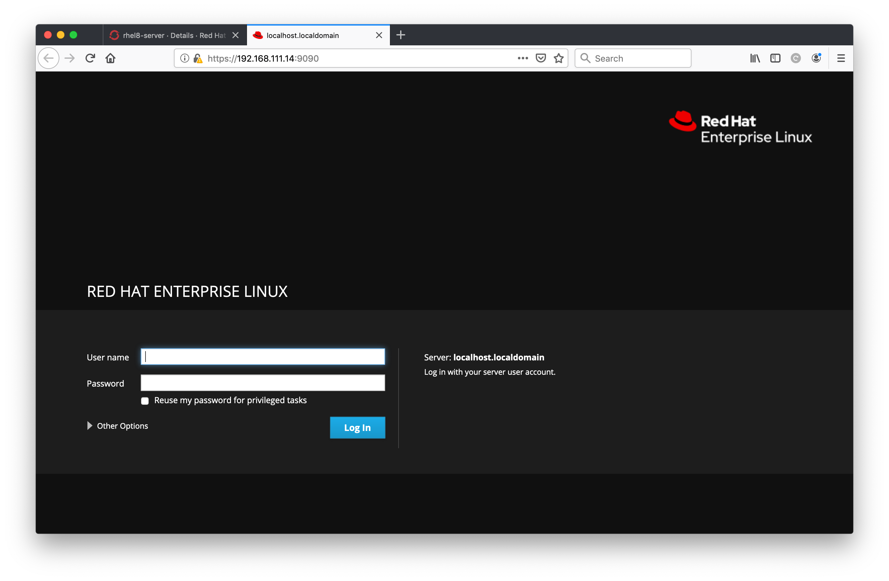
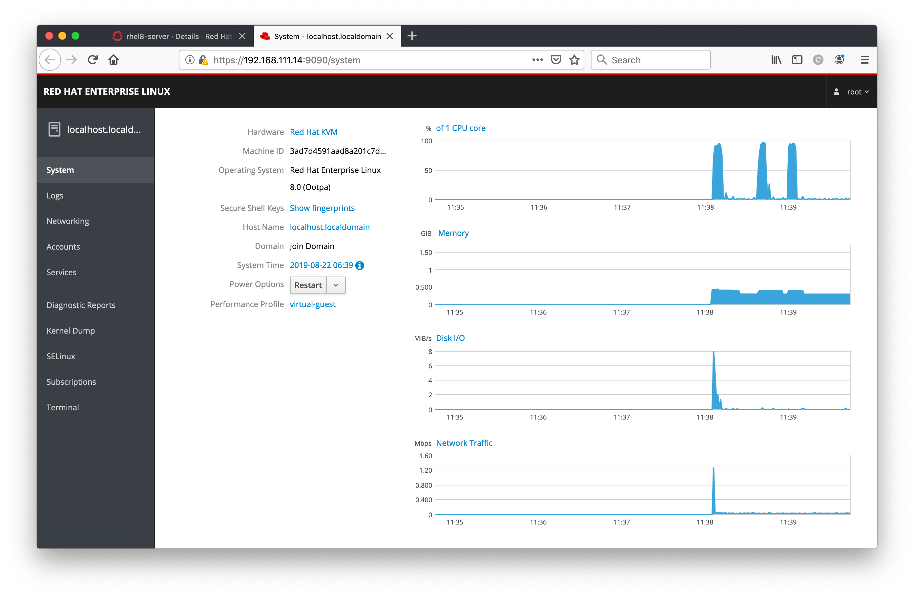
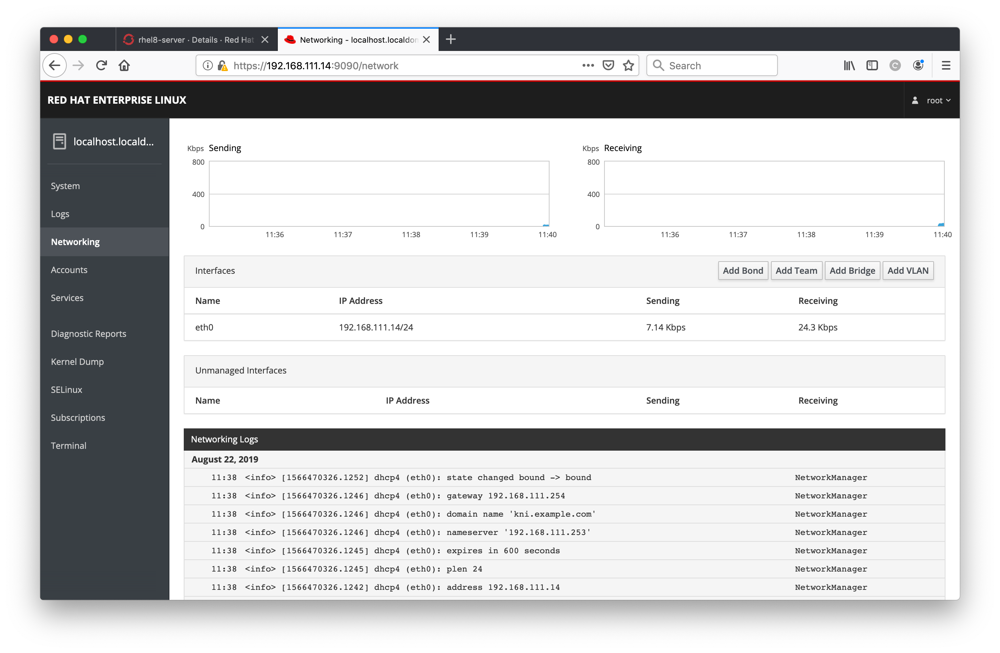

#**Running Workloads in the Environment**

Let's get into actually testing some workloads on our environment... we've spent all of this time building it up but we haven't even proven that it's working properly yet! In this section we're going to be deploying some pods as well as deploying a VM using OpenShift virtualization.

## Deploying a Container

OK, so this is likely something that you've all done before, and it's hardly very exciting, but let's have a little bit of fun. Let's deploy a nifty little application inside of a pod and use it to verify that the OpenShift cluster is functioning properly; this will involve building an application from source and exposing it to your web-browser. We'll use the s2i (source to image) container type:

~~~bash
[lab-user@provision ~]$ oc project default
Already on project "default" on server "https://api.schmaustech.students.osp.opentlc.com:6443".
[lab-user@provision ~]$ oc new-app nodeshift/centos7-s2i-nodejs:12.x~https://github.com/vrutkovs/DuckHunt-JS
--> Found container image 5b0b75b (11 months old) from Docker Hub for "nodeshift/centos7-s2i-nodejs:12.x"

    Node.js 12.12.0 
    --------------- 
    Node.js  available as docker container is a base platform for building and running various Node.js  applications and frameworks. Node.js is a platform built on Chrome's JavaScript runtime for easily building fast, scalable network applications. Node.js uses an event-driven, non-blocking I/O model that makes it lightweight and efficient, perfect for data-intensive real-time applications that run across distributed devices.

    Tags: builder, nodejs, nodejs-12.12.0

    * An image stream tag will be created as "centos7-s2i-nodejs:12.x" that will track the source image
    * A source build using source code from https://github.com/vrutkovs/DuckHunt-JS will be created
      * The resulting image will be pushed to image stream tag "duckhunt-js:latest"
      * Every time "centos7-s2i-nodejs:12.x" changes a new build will be triggered

--> Creating resources ...
    buildconfig.build.openshift.io "duckhunt-js" created
    deployment.apps "duckhunt-js" created
    service "duckhunt-js" created
--> Success
    Build scheduled, use 'oc logs -f bc/duckhunt-js' to track its progress.
    Application is not exposed. You can expose services to the outside world by executing one or more of the commands below:
     'oc expose svc/duckhunt-js' 
    Run 'oc status' to view your app.
~~~

Now our application will build from source, you can watch it happen with:

~~~bash
[lab-user@provision ~]$ oc logs duckhunt-js-1-build -f
Caching blobs under "/var/cache/blobs".
Getting image source signatures
Copying blob sha256:d8d02d45731499028db01b6fa35475f91d230628b4e25fab8e3c015594dc3261
Copying blob sha256:a11069b6e24573a516c9d542d7ed33adc115ebcde49101037d153958d3bc2e01
(...)
Writing manifest to image destination
Storing signatures
Successfully pushed image-registry.openshift-image-registry.svc:5000/default/duckhunt-js@sha256:a2eff4eca82019b2752bfbe7ab0f7dcb6875cc9a6ec16b09f351dd933612300b
Push successful
~~~

Now you can check if the Duckhunt pod has finished building and is running:

~~~bash
[lab-user@provision ~]$ oc get pods
NAME                          READY   STATUS      RESTARTS   AGE
duckhunt-js-1-build           0/1     Completed   0          2m21s
duckhunt-js-cb885554b-qqmw2   1/1     Running     0          39s
~~~

Now expose the application (via the service) so we can route to it from the outside...

~~~bash
[lab-user@provision ~]$ oc expose svc/duckhunt-js
route.route.openshift.io/duckhunt-js exposed

[lab-user@provision ~]$ oc get route duckhunt-js
NAME          HOST/PORT                                                       PATH   SERVICES      PORT       TERMINATION   WILDCARD
duckhunt-js   duckhunt-js-default.apps.schmaustech.students.osp.opentlc.com          duckhunt-js   8080-tcp                 None
~~~

Now you should be able to open up the application in the same browser that you're using for access to the OpenShift console. Copy and paste the host address from above and you should now be able to have a quick play with this... good luck ;-

Now, if you can tear yourself away from the game, let's build a VM...

## Deploying a Virtual Machine (Schmaus needs to test and clean up still)

Now for the main task, let's deploy a VM on-top of our OpenShift cluster with Openshift virtualization. There's a few things we need to configure before we can do this, namely ensuring that we've got networking set-up correctly to serve our VM. Out of the box, Openshift virtualization will simply attach networking in the same way that pod networking works, i.e. the VM will be mapped to the default Kubernetes network and will have limited network possibilities; remember that Kubernetes networking was designed for containerised applications, not for serving virtual machines that likely have much more complicated requirements.

Through Kubernetes' [container network interface](https://github.com/containernetworking/cni) (CNI) it's possible to setup all of your pods (and hence VM's) to attach to different network types, including SR/IOV, bridged networking, MACVLAN, and also to a wide variety of third party providers including Contrail and Calico, etc. The problem with this approach is that you're changing the core CNI plugin that Kubernetes uses for networking, and therefore normal functions that Kubernetes (and therefore OpenShift) provide may not be available, e.g. routes, cross-cluster communication via the internal IP's, and so on.

The generally accepted approach today is to leverage [Multus](https://github.com/intel/multus-cni) which provides the best of both worlds - it allows multiple CNI plugins to be utilised simultaneously, e.g. keep the base Kubernetes CNI for all of the basic functionality on one plugged interface, and then use an additional interface configured by another plugin, e.g. bridged networking, so your pod/VM has more than one network interface for different requirements. That's exactly what we're going to do here - we're going to leverage Multus to attach a virtual machine to a bridge interface instead of just the core Kubernetes network.

The first thing we need to do here is to create a `NetworkAttachmentDefinition` that defines what the networking configuration is for a given name, e.g. when we tell OpenShift/Kubernetes to attach our pod/VM to a specific network, the CNI knows exactly what to do. Let's define a new definition for a bridge network in our environment:

~~~bash
kni@provisioner$ oc project default
Already on project "default" on server "https://api.kni.example.com:6443".

kni@provisioner$ cat <<EOF | oc create -f -
apiVersion: "k8s.cni.cncf.io/v1"
kind: NetworkAttachmentDefinition
metadata:
  name: brext
spec:
  config: '{
      "cniVersion": "0.3.1",
      "name": "brext",
      "type": "cnv-bridge",
      "bridge": "brext",
      "ipam": {}
    }'
EOF

networkattachmentdefinition.k8s.cni.cncf.io/brext created
~~~

> **NOTE**: The important flags to recognise here are the **type** of **cnv-bridge** which is a specific implementation that links in-VM interfaces to a counterpart on the underlying host for full-passthrough of networking. Also note that **ipam** is blank - we don't want the CNI to manage the network allocation for us - the network we want to attach to has DHCP enabled, and so let's not get involved. It does mean that Kubernetes won't know the IP address of the pod/VM, but we can get around that!

This means we can actually use the configuration for attaching VM's to a bridge named **'brext'**, whereas typically any pod would just use the default kubernetes network. If this bridge doesn't exist on the host, binding will fail and the VM will fail to launch. Out of the box, this bridge will not exist, and the usual mechanism (as per OpenShift's approach to simplifying the deployment process) it to add/change things post-deployment. As CoreOS is immutable, any configuration changes we attempt to make to the running systems will be wiped out if they get rebooted, so we typically need to make these changes persistent.

The way to do this properly with OpenShift is to modify the `Machine` configuration through the `MachineConfigOperator`, which will make the necessary changes to the underlying filesystem, and reboot the nodes in order, ensuring that the pods remain resilient and that API service continues throughout. This process typically takes about an hour on these virtualised systems so we wanted to avoid that waiting around during this lab, hence the **'brext'** bridge is already in place, and was created during the installation behind the scenes.

For those of you interested, you can see the contents of the `MachineConfig` here:

~~~bash
kni@provisioner$ cat ~/dev-scripts/assets/generated/99_master-brext.yaml
apiVersion: machineconfiguration.openshift.io/v1
kind: MachineConfig
metadata:
  labels:
    machineconfiguration.openshift.io/role: master
  name: 99-brext-master
spec:
  config:
    ignition:
      version: 2.2.0
    storage:
      files:
      - contents:
          source: data:text/plain;charset=utf-8;base64,REVWSUNFPWJyZXh0Ck5BTUU9YnJleHQKVFlQRT1CcmlkZ2UKT05CT09UPXllcwpOTV9DT05UUk9MTEVEPXllcwpCT09UUFJPVE89ZGhjcA==
        filesystem: root
        mode: 0644
        path: /etc/sysconfig/network-scripts/ifcfg-brext
~~~

Note the 'path' of the files that we're trying to create/update above. If you take the base64 encoded string above, you can verify the contents of the files that we're asking to be applied:

~~~bash
kni@provisioner$ echo REVWSUNFPWJyZXh0Ck5BTUU9YnJleHQKVFlQRT1CcmlkZ2UKT05CT09UPXllcwpOTV9DT05UUk9MTEVEPXllcwpCT09UUFJPVE89ZGhjcA== | base64 -d
DEVICE=brext
NAME=brext
TYPE=Bridge
ONBOOT=yes
NM_CONTROLLED=yes
~~~

So as part of the initial deployment of our cluster, it created this '**brext**' bridge for us and rolled out the *sysconfig/network-scripts* file. In addition, we also force the interface '**ens4**' to be part of the bridge upon boot using this NetworkManager *dispatcher.d* script; we have to do this because by default CoreOS tries to come up on all interfaces via DHCP and writes ifcfg files at boot time...

~~~bash
kni@provisioner$ cat ~/dev-scripts/assets/files/etc/NetworkManager/dispatcher.d/98-brextscript
#!/usr/bin/env bash

IF=$(ip r | grep default | grep -Po '(?<=dev )(\S+)')
if $(grep -q "dracut" /etc/sysconfig/network-scripts/ifcfg-$IF); then
echo brext acting on $IF
cat <<EOF > /etc/sysconfig/network-scripts/ifcfg-$IF
DEVICE=$IF
BRIDGE=brext
ONBOOT=yes
NM_CONTROLLED=yes
BOOTPROTO=none
EOF
systemctl restart NetworkManager
nmcli conn down $IF
fi
~~~

> **NOTE**: Showing you these files was just for your reference at this stage on how we configured the '**brext**' bridge out of the box without you needing to configure the `MachineConfigOperator` post-deployment. This was a workaround to squeeze the lab into the time allotted - as stated, the *right* way to do this would be to apply the bridge post-deployment, but that takes ~60m just waiting for the nodes to reboot!

## OpenShift Networking Configuration

Next up, due to a [multus bug](https://bugzilla.redhat.com/show_bug.cgi?id=1732598) we have to update the configuration file for OpenShift networking; this configuration will enable us to utilise Multus as our backend for networking in our pods and VM's, i.e. by default all pods (and VM's) will be attached to the default kubernetes pod network, but we can specific additional network interfaces dynamically. Let's first create this configuration file:

~~~bash
kni@provisioner$ cat << EOF >> 80-openshift-network.conf
{
    "delegates": [
        {
            "cniVersion": "0.3.1",
            "name": "openshift-sdn",
            "type": "openshift-sdn"
        }
    ],
    "kubeconfig": "/etc/kubernetes/cni/net.d/multus.d/multus.kubeconfig",
    "logLevel": "verbose",
    "name": "openshift-sdn",
    "namespaceIsolation": true,
    "type": "multus"
}
EOF
~~~

Now we can copy the file to each of the nodes:

~~~bash
kni@provisioner$ for node in $(oc get nodes -o jsonpath="{.items[*].metadata.name}"); \
	do scp -o StrictHostKeyChecking=no 80-openshift-network.conf core@$node:/tmp/; \
	ssh -o StrictHostKeyChecking=no core@$node "sudo mv /tmp/80-openshift-network.conf \
	/etc/kubernetes/cni/net.d/80-openshift-network.conf"; done

Warning: Permanently added 'master-0,192.168.111.2' (ECDSA) to the list of known hosts.
80-openshift-network.conf                                                                           100%  341   439.4KB/s   00:00
Warning: Permanently added 'master-1,192.168.111.3' (ECDSA) to the list of known hosts.
80-openshift-network.conf                                                                           100%  341   336.1KB/s   00:00
Warning: Permanently added 'master-2,192.168.111.4' (ECDSA) to the list of known hosts.
80-openshift-network.conf                                                                           100%  341   307.7KB/s   00:00
Warning: Permanently added 'worker-0,192.168.111.6' (ECDSA) to the list of known hosts.
80-openshift-network.conf                                                                           100%  341   383.8KB/s   00:00
~~~

> **NOTE**: This is a hack/workaround - if the nodes are rebooted this configuration will be lost. But it's intended that this bug will be fixed before OpenShift 4.2 goes GA.

That's it! Networking should now be configured properly for our needs.

## Creating a Persistent Volume

When we launch our VM we've got a few different options for where the VM/instance disk source comes from. We can choose to PXE boot it, we can attach an ISO, or we can attach a persistent volume directly. In our example we're going to attach a persistent volume, but we're going to be a little clever and use KubeVirt's storage import tool that will take a qcow2 and inject it into a persistent volume, akin to OpenStack's volume from image functionality. On the network we've placed the latest copy of a Red Hat Enterprise Linux 8 qcow2 that we've set the root password on. Let's create a persistent volume with this qcow2 as its contents:

~~~bash
kni@provisioner$ cat << EOF | oc create -f -
apiVersion: v1
kind: PersistentVolumeClaim
metadata:
  name: "rhel8"
  labels:
    app: containerized-data-importer
  annotations:
    cdi.kubevirt.io/storage.import.endpoint: "http://192.168.111.253/rhel-8.0-x86_64-kvm.qcow2"
spec:
  volumeMode: Block
  accessModes:
  - ReadWriteMany
  resources:
    requests:
      storage: 40Gi
EOF

persistentvolumeclaim/rhel8 created
~~~

Now we can verify that it was able to create it successfully:

~~~bash
kni@provisioner$ $ oc get pvc
NAME    STATUS   VOLUME                                     CAPACITY   ACCESS MODES   STORAGECLASS   AGE
rhel8   Bound    pvc-e4d90bdf-bb5a-11e9-a249-2cc260010202   40Gi       RWX            csi-rbd        12s
~~~

If you're quick you will see a new importer pod will have been spawned in your default namespace:

~~~bash
kni@provisioner$ $ oc get pods | egrep '(NAME|importer)'
NAME                   READY   STATUS    RESTARTS   AGE
importer-rhel8-j87ht   0/1     Pending   0          2s
~~~

If you ask for more details of this pod you'll see that it has mounted the PVC in question, and is importing the volume, although given this process is really quick, you may not see this and may have errors trying to find the pod, so the output below gives you an idea of what's happening:

~~~bash
kni@provisioner$ oc describe pod $(oc get pods | awk '/importer/ {print $1;}')
Name:               importer-rhel8-j87ht
Namespace:          default
Priority:           0
PriorityClassName:  <none>
Node:               worker-0/192.168.111.6
Start Time:         Wed, 28 Aug 2019 07:39:30 -0400
Labels:             app=containerized-data-importer
                    cdi.kubevirt.io=importer
                    cdi.kubevirt.io/storage.import.importPvcName=rhel8
                    prometheus.cdi.kubevirt.io=
Annotations:        cdi.kubevirt.io/storage.createdByController: yes
Status:             Pending
IP:
Controlled By:      PersistentVolumeClaim/rhel8
Containers:
  importer:
    Container ID:
    Image:         registry.redhat.io/container-native-virtualization/virt-cdi-importer:v2.0.0-27
    Image ID:
    Port:          8443/TCP
    Host Port:     0/TCP
    Args:
      -v=1
    State:          Waiting
      Reason:       ContainerCreating
    Ready:          False
    Restart Count:  0
    Environment:
      IMPORTER_SOURCE:       http
      IMPORTER_ENDPOINT:     http://192.168.111.253/rhel-8.0-x86_64-kvm.qcow2
      IMPORTER_CONTENTTYPE:  kubevirt
      IMPORTER_IMAGE_SIZE:   40Gi
      OWNER_UID:             7caa9cd9-c988-11e9-a247-2cc260010203
      INSECURE_TLS:          false
    Mounts:
      /var/run/secrets/kubernetes.io/serviceaccount from default-token-5l68k (ro)
    Devices:
      /dev/blockDevice from cdi-data-vol
Conditions:
  Type              Status
  Initialized       True
  Ready             False
  ContainersReady   False
  PodScheduled      True
Volumes:
  cdi-data-vol:
    Type:       PersistentVolumeClaim (a reference to a PersistentVolumeClaim in the same namespace)
    ClaimName:  rhel8
    ReadOnly:   false
  default-token-5l68k:
    Type:        Secret (a volume populated by a Secret)
    SecretName:  default-token-5l68k
    Optional:    false
QoS Class:       BestEffort
Node-Selectors:  <none>
Tolerations:     node.kubernetes.io/not-ready:NoExecute for 300s
                 node.kubernetes.io/unreachable:NoExecute for 300s
Events:
  Type     Reason                  Age              From                     Message
  ----     ------                  ----             ----                     -------
  Warning  FailedScheduling        41s (x3 over 43s)  default-scheduler        pod has unbound immediate PersistentVolumeClaims (repeated 4 times)
  Normal   Scheduled               38s                default-scheduler        Successfully assigned default/importer-rhel8-j87ht to worker-0
  Normal   SuccessfulAttachVolume  38s                attachdetach-controller  AttachVolume.Attach succeeded for volume "pvc-7caa9cd9-c988-11e9-a247-2cc260010203"
  Normal   SuccessfulMountVolume   30s                kubelet, worker-0        MapVolume.MapDevice succeeded for volume "pvc-7caa9cd9-c988-11e9-a247-2cc260010203" globalMapPath "/var/lib/kubelet/plugins/kubernetes.io/csi/volumeDevices/pvc-7caa9cd9-c988-11e9-a247-2cc260010203/dev"
  Normal   SuccessfulMountVolume   30s                kubelet, worker-0        MapVolume.MapDevice succeeded for volume "pvc-7caa9cd9-c988-11e9-a247-2cc260010203" volumeMapPath "/var/lib/kubelet/pods/7caf6c53-c988-11e9-a976-2cc260010202/volumeDevices/kubernetes.io~csi"
  Normal   Pulling                 22s                kubelet, worker-0        Pulling image "registry.redhat.io/container-native-virtualization/virt-cdi-importer:v2.0.0-27"
  Normal   Pulled                  11s                kubelet, worker-0        Successfully pulled image "registry.redhat.io/container-native-virtualization/virt-cdi-importer:v2.0.0-27"
  Normal   Created                 11s                kubelet, worker-0        Created container importer
  Normal   Started                 11s                kubelet, worker-0        Started container importer
~~~

> **NOTE**: We shouldn't try and use this PVC until the importer pod has finished as it'll cause boot issues.

Whilst that does it's job we can also verify that the PVC has been created within Ceph:

~~~bash
kni@provisioner$ export NAMESPACE=openshift-storage
kni@provisioner$ oc exec -it $(oc get pod -n ${NAMESPACE} \
	-l app=rook-ceph-tools -o jsonpath="{.items[0].metadata.name}") \
	-n ${NAMESPACE} -- rbd ls

csi-vol-e5a4764d-bb5a-11e9-bdb0-0a580a820070

kni@provisioner$ oc exec -it $(oc get pod -n ${NAMESPACE} \
	-l app=rook-ceph-tools -o jsonpath="{.items[0].metadata.name}") \
	-n ${NAMESPACE} -- rbd info csi-vol-e5a4764d-bb5a-11e9-bdb0-0a580a820070

rbd image 'csi-vol-e5a4764d-bb5a-11e9-bdb0-0a580a820070':
        size 40 GiB in 10240 objects
        order 22 (4 MiB objects)
        snapshot_count: 0
        id: dd1452dca348
        block_name_prefix: rbd_data.dd1452dca348
        format: 2
        features: layering
        op_features:
        flags:
        create_timestamp: Sat Aug 10 10:37:51 2019
        access_timestamp: Sat Aug 10 10:37:51 2019
        modify_timestamp: Sat Aug 10 10:37:51 2019
~~~

## Deploying a VM in OpenShift virtualization

Now we're ready to deploy our first virtual machine in OpenShift virtualization, backed by the RHEL 8 guest image based PVC from the previous step. There's a few different ways of doing this, but for speed and convenience we're going to create the `VirtualMachine` resource via the command-line, and then inspect it via the web-console in a later step.

Assuming that your importer pod has completed, let's create the virtual machine:

~~~bash
kni@provisioner$ cat << EOF | oc create -f -
apiVersion: kubevirt.io/v1alpha3
kind: VirtualMachine
metadata:
  annotations:
    name.os.template.kubevirt.io/rhel8: Red Hat Enterprise Linux 8.0
  labels:
    flavor.template.kubevirt.io/small: "true"
    kubevirt.io/os: rhel8
    os.template.kubevirt.io/rhel8: "true"
    template.kubevirt.ui: openshift_rhel8-generic-large
    vm.kubevirt.io/template: rhel8-generic-small
    workload.template.kubevirt.io/generic: "true"
    app: rhel8-server
  name: rhel8-server
spec:
  running: true
  template:
    metadata:
      labels:
        vm.kubevirt.io/name: rhel8-server
    spec:
      domain:
        clock:
          timer:
            hpet:
              present: false
            hyperv: {}
            pit:
              tickPolicy: delay
            rtc:
              tickPolicy: catchup
          utc: {}
        devices:
          disks:
          - disk:
              bus: sata
            name: pvcvolume
          interfaces:
          - bridge: {}
            model: e1000
            name: brext
        features:
          acpi: {}
          apic: {}
          hyperv:
            relaxed: {}
            spinlocks:
              spinlocks: 8191
            vapic: {}
        firmware:
          uuid: 5d307ca9-b3ef-428c-8861-06e72d69f223
        machine:
          type: q35
        resources:
          requests:
            memory: 2048M
      evictionStrategy: LiveMigrate
      networks:
        - multus:
            networkName: brext
          name: brext
      terminationGracePeriodSeconds: 0
      volumes:
      - name: pvcvolume
        persistentVolumeClaim:
          claimName: rhel8
EOF

virtualmachine.kubevirt.io/rhel8-server created
~~~

Whilst our VM (hopefully) boots up, let's take a look at some of the parameters that we specified in the resource definition. See below for a selection of some of the definition with some annotations:

~~~
	flavor.template.kubevirt.io/small: "true"
        devices:                 ^-- this specifies the VM sizing, like OpenStack
          disks:
          - disk:                <-- this is an individual disk entry
              bus: sata          <-- this specifies the bus type for the disk
            name: pvcvolume      <-- this specifies the storage label to map to
          interfaces:
          - bridge: {}           <-- this specifies the network interface type
            model: e1000         <-- this specifies the nic type (Intel e1000)
            name: brext          <-- this specifies the network label to map to
      networks:
        - multus:                <-- this tells Kubernetes to use the Multus CNI
            networkName: brext   <-- this specifies the network definition to use
          name: brext            <-- this links the network label to a definition
      volumes:
      - name: pvcvolume	         <-- this links the storage label to a definition
        persistentVolumeClaim:
          claimName: rhel8       <-- this is the name of the PVC to attach to VM

~~~

So how do we verify that our VM is actually running actually running?

~~~bash
kni@provisioner$ oc get vmis
NAME           AGE    PHASE     IP                  NODENAME
rhel8-server   2m9s   Running   192.168.111.14/24   master-2
~~~

> **NOTE**: It may take a little while for the IP address to show up as we're reliant on the guest-agent to report back, we're not using Kubernetes IPAM here, it's our external DHCP server.

Here you can see that our VM has been started, has an IP address on the same network as our baremetal nodes (thanks to our **brext** bridge, and the external DHCP server in the lab environment), and is running on master-2 (yours may run on a different node).

If you return back to your web-browser where you were accessing the OpenShift console you should be able to see the VM listed (see "**Workloads**" --> "**Virtual Machines**" on the left-hand side menu, and select the "**rhel8-server**" item). You should see something similar to the following:

You should also be able to select the "**Console**" tab and see the virtual console o this VM, which can be really handy for troubleshooting:

> **NOTE**: In the screenshot above I've already logged in, yours won't automatically login. If you see a boot failure, try restarting the VM as you may have been too quick and the importer may not have finished yet.

If we return to our console, let's make sure it's actually coming up as expected on the network:

~~~bash
kni@provisioner$ ping -c4 192.168.111.14
PING 192.168.111.14 (192.168.111.14) 56(84) bytes of data.
64 bytes from 192.168.111.14: icmp_seq=1 ttl=64 time=2.06 ms
64 bytes from 192.168.111.14: icmp_seq=2 ttl=64 time=2.15 ms
64 bytes from 192.168.111.14: icmp_seq=3 ttl=64 time=1.23 ms
(...)

kni@provisioner$ ssh root@192.168.111.14
(...)
~~~

> **NOTE**: The root password is just '**redhat**' for this guest image.

Let's verify a few things, that the VM has the right IP listed and is the right guest image:

~~~bash
root@vm# ip addr show dev eth0
2: eth0: <BROADCAST,MULTICAST,UP,LOWER_UP> mtu 1500 qdisc fq_codel state UP group default qlen 1000
    link/ether f6:90:0b:63:b2:ad brd ff:ff:ff:ff:ff:ff
    inet 192.168.111.14/24 brd 192.168.111.255 scope global dynamic noprefixroute eth0
       valid_lft 503sec preferred_lft 503sec
    inet6 fe80::f490:bff:fe63:b2ad/64 scope link noprefixroute
       valid_lft forever preferred_lft forever

root@vm# uname -a
Linux localhost.localdomain 4.18.0-80.4.2.el8_0.x86_64 #1 SMP Fri Jun 14 13:20:24 UTC 2019 x86_64 x86_64 x86_64 GNU/Linux

root@vm# cat /etc/redhat-release
Red Hat Enterprise Linux release 8.0 (Ootpa)
~~~

So SSH works, how about we see if we can access the system over HTTP. Let's enable the cockpit service that RHEL8 ships with:

~~~bash
root@vm# systemctl enable --now cockpit.socket
Created symlink /etc/systemd/system/sockets.target.wants/cockpit.socket → /usr/lib/systemd/system/cockpit.socket.
~~~

Now, if we open another tab in our proxy-enabled web-browser and navigate [here](https://192.168.111.14:9090)(https://192.168.111.14:9090) you should see the login page for Cockpit; you may need to accept some self-signed certificates too. The login is simply "root/redhat":

> **NOTE**: Your system **should** come up on .14 as that's the next available DHCP IP, but adjust to suit if it comes up on a different IP in your environment.

Now you should be able to poke around on the cockput UI to investigate the VM:

And also validate that the VM is able to see the correct network interface and the IP address specified:

**Success**, we're done! Congratulations... if you've made it this far you've deployed KNI from the ground up, deployed Ceph via Rook, Container Native Virtualisation (CNV), and tested the solution with pods and VM's via the CLI and the OpenShift dashboard! I'd like to ***thank you*** for attending this lab; I hope that it was a valuable use of your time and that your learnt a lot from doing it. Please do let us know if there's anything else we can do to support you! There's also a CNV-based lab here at Red Hat Tech Exchange if you're keen on exploring it further.
